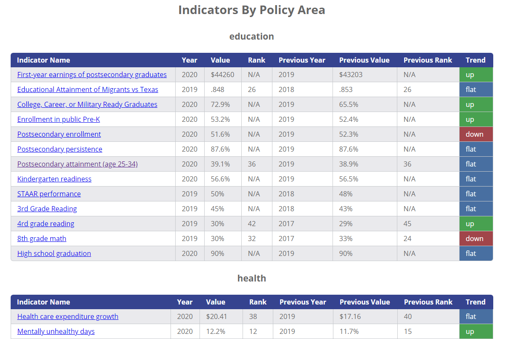
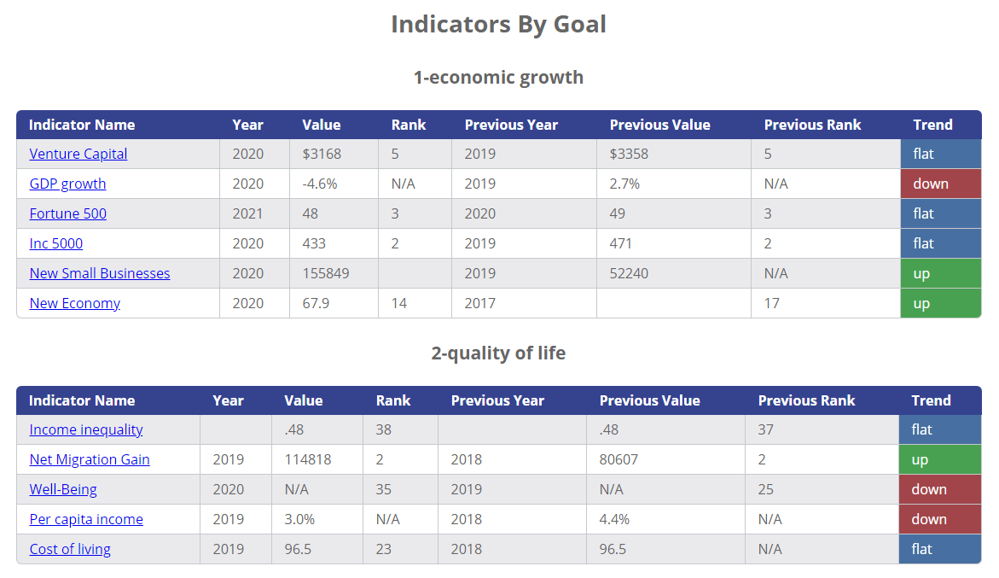
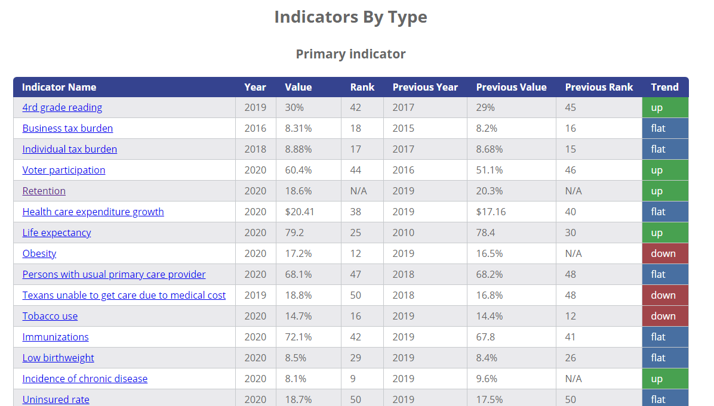
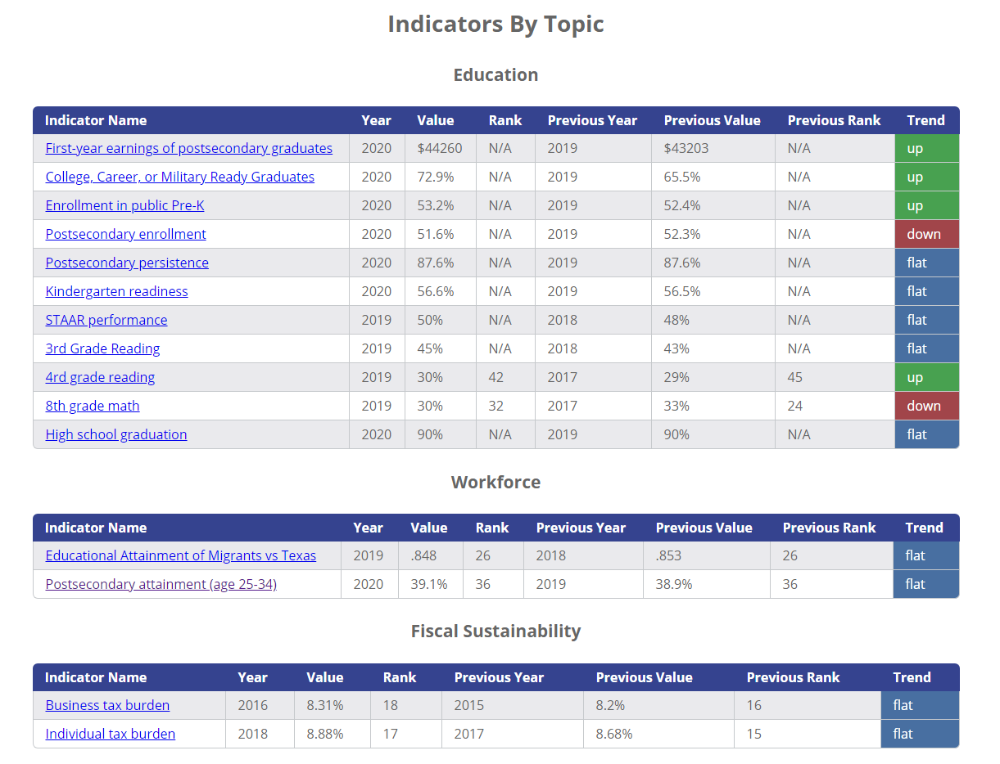
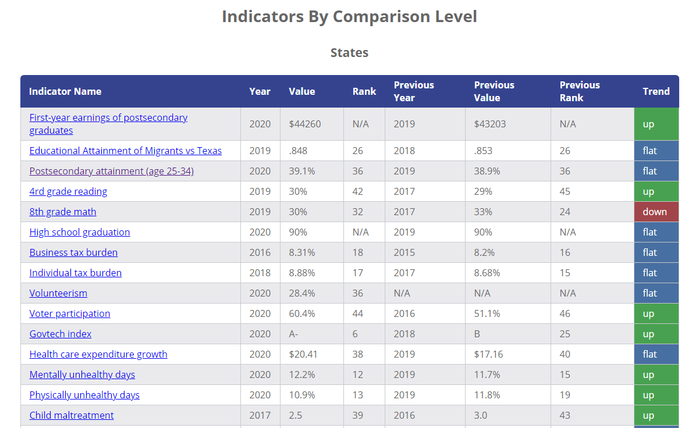
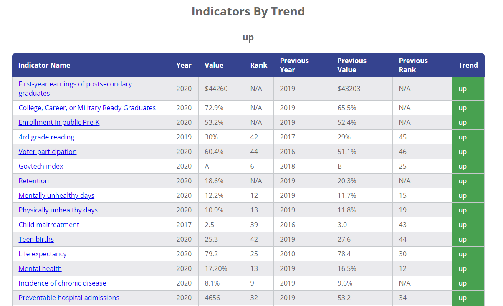

[Indicators By Policy Area](./area_table.html)

[Indicators By Goal](./goal_table.html)

[Indicators by Type (Primary/Secondary)](./primary_table.html)

[Indicators By Topic](./topic_table.html)

[Indicators By Comparison Level](./comparison_table.html)

[Indicators by Trend](./trend_table.html)

[Full Indicator Table](./indicator_table.html)

[Percent Positive Trend By Policy Area]

[Link to Excel Spreadsheet]

