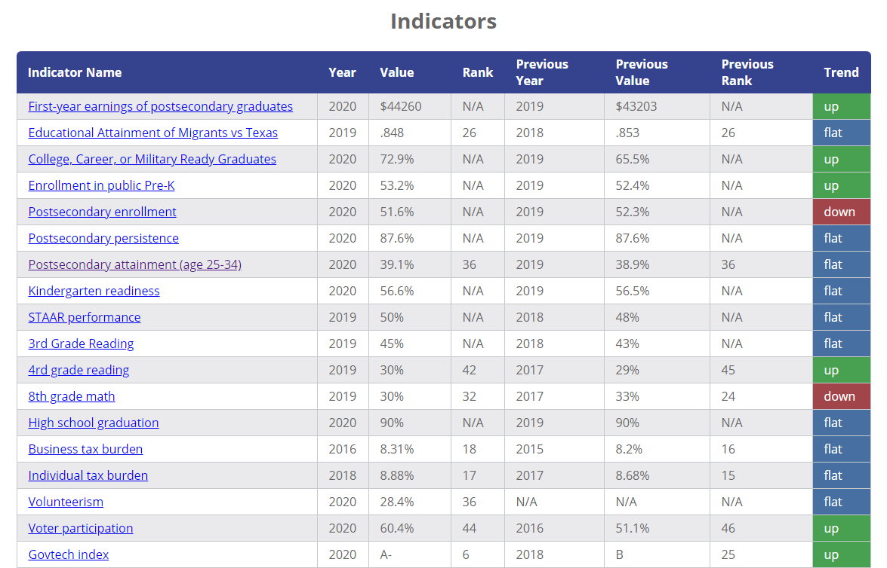

# Texas 2036 Indicators

[Full Indicator Table](./indicator_table.html)

[Indicators By Policy Area](./area_table.html)

[Indicators By Goal](./goal_table.html)

[Indicators by Type (Primary/Secondary)](./primary_table.html)

[Indicators By Topic](./topic_table.html)

[Percent Positive Trend By Policy Area]

[Link to Excel Spreadsheet]

#### Primary

🟢 [Percent of annual graduates demonstrating college, career, or military readiness](./education/Percent of annual graduates demonstrating college, career, or military readiness/report2.md)

🔴 [Percent of students at or above Meets Grade Level on the STAAR Grade 3 reading assessment](./education/Percent of students at or above Meets Grade Level on the STAAR Grade 3 reading assessment/report2.md)

🟢 [Percent of high school graduates who earned a certificate or degree from a Texas phei within 6 years of high school graduation](./education/Percent of high school graduates who earned a certificate or degree from a Texas phei within 6 years of high school graduation/report2.md)

🔴 [4th grade reading](./education/4th grade reading/report2.md)

🟢 [Percent of working population earning a mid- or high-wage](./education/Percent of working population earning a mid- or high-wage/report.md)

#### Secondary

🟢 [Average first-year earnings of graduates who earned a certificate or degree from a Texas public higher education institution](./education/Average first-year earnings of graduates who earned a certificate or degree from a Texas public higher education institution/report2.md)

<!---
[Median earnings of high school graduates who earned an Associate's or Bachelor's degree from a Texas public higher education institution](./education/Median earnings of high school graduates who earned an Associate's or Bachelor's degree from a Texas public higher education institution/report.md)
--->

🟢 [Percent of eligible 3- and 4-year-olds enrolled in public Pre-K](./education/Percent of eligible 3- and 4-year-olds enrolled in public Pre-K/report2.md)

🟢 [Percent of high school graduates who enrolled in a Texas phei the fall semester following high school graduation](./education/Percent of high school graduates who enrolled in a Texas phei the fall semester following high school graduation/report2.md)

🟢 [Percent of high school graduates who enrolled in a Texas phei the fall semester following high school graduation and returned](./education/Percent of high school graduates who enrolled in a Texas phei the fall semester following high school graduation and returned/report.md)