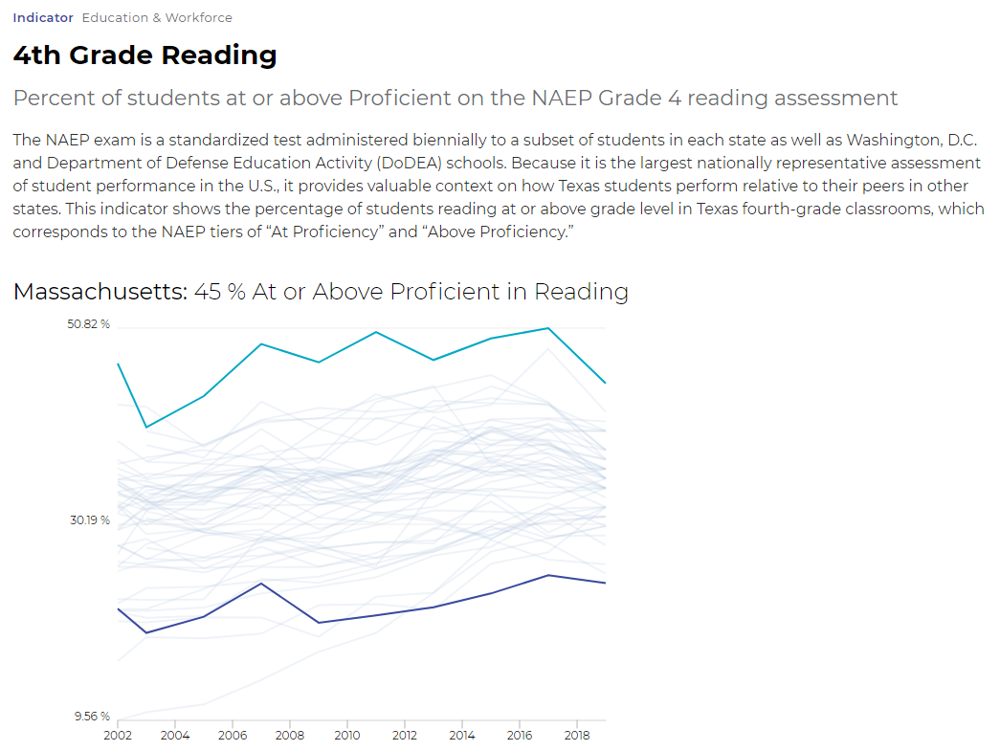

# 4th grade reading

## Education & Workforce 

### Primary Indicator

### **Goal**

Early childhood

Texas children get a strong early start to succeed in school and life

### **Value**

| Year        |  Value      | Rank        | Previous Year| Previous Value| Previous Rank  | Trend | 
| ----------- | ----------- | ----------- | ----------- | ----------- | ----------- | -----------|
|             |    216      | 44          |             |   215       | N/A         | 📈         | 

### **Data**

### **Source**
[NAEP](https://www.nationsreportcard.gov/ndecore/xplore/NDE)

[NAEP Map](https://www.nationsreportcard.gov/reading/states/scores/?grade=4)

### **Notes**
NAEP Assessment is every 2 years (previous was 2019)

### Indicator Page

[Indicator Page](https://indicators.texas2036.org/indicator/35)

### DataLab Page

[DataLab Link](https://datalab.texas2036.org/igxywpc/national-assessment-of-educational-progress-naep-assessments-of-united-states?accesskey=xojlwjb)

