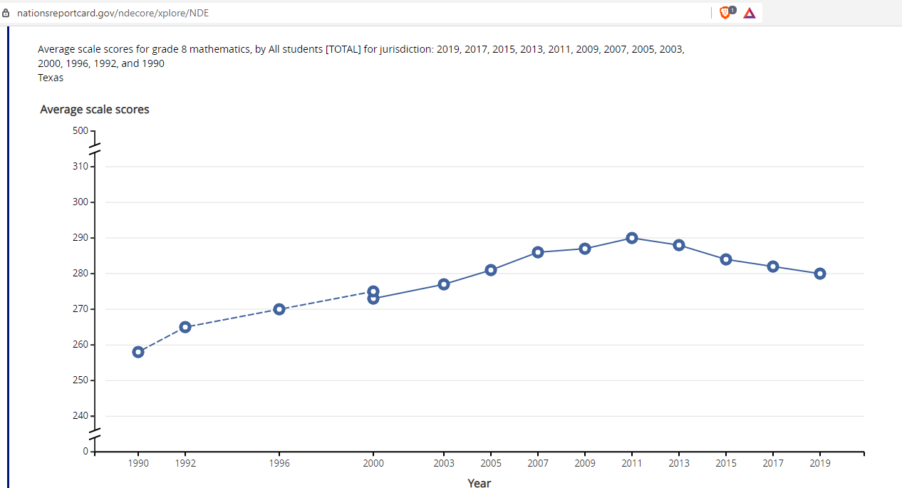
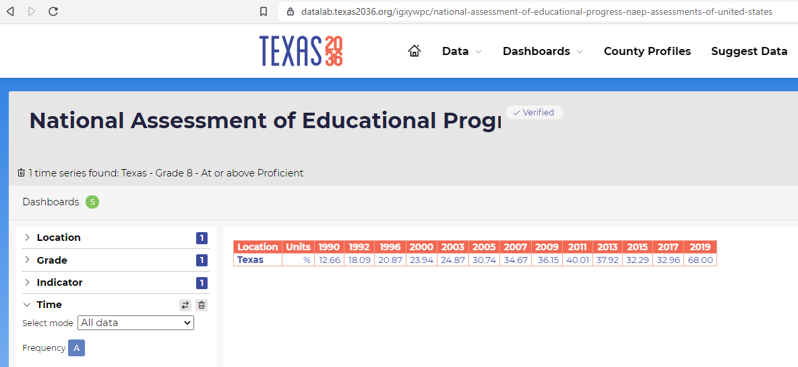

# 8th grade math

## Education & Workforce 

### Secondary Indicator

### **Goal**

K-12

Texas students graduate high school ready for postsecondary success

### **Value**

|  Value      | Rank        | Previous Value | Previous Rank | Trend | 
| ----------- | ----------- | ----------- | ----------- | -----------|
     280  | N/A         |    282   | N/A         | 📈     | 

### **Data**

<!--  -->

### **Source**
[NAEP](https://www.nationsreportcard.gov/ndecore/xplore/NDE)

### **Notes**
NAEP Assessment is every 2 years (previous was 2019)

Average Scale Score

### DataLab 

[DataLab Link](https://datalab.texas2036.org/igxywpc/national-assessment-of-educational-progress-naep-assessments-of-united-states)

### Indicator Page

[Indicator Page](https://indicators.texas2036.org/indicator/35)

### Strategic Framework

