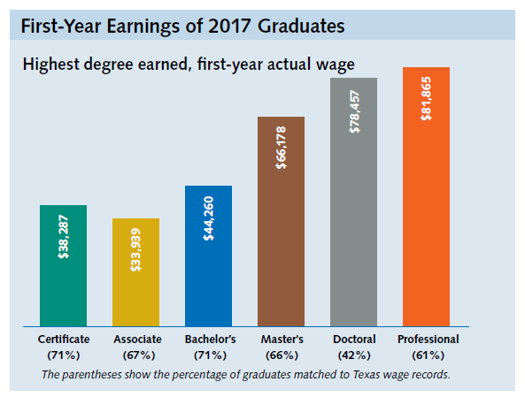

# Average first-year earnings of graduates who earned a certificate or degree from a Texas public higher education institution

## Education & Workforce 

### Value

|  Value      | Rank        | Previous Value | Previous Rank | Trend | 
| ----------- | ----------- | ----------- | ----------- | -----------|
| $44,260       | N/A         |    $43,203    | N/A         | 📈       | 

### Data

Previous Year:

### Source

[Texas Higher Education Almanac - 2020](http://reportcenter.highered.texas.gov/agency-publication/almanac/2020-texas-public-higher-education-almanac/)

### Notes: