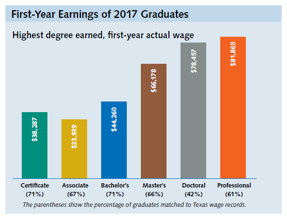
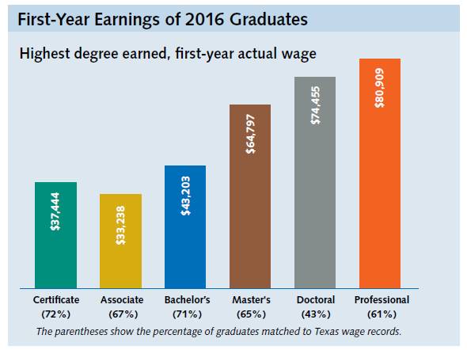

# First-year earnings

Average first-year earnings of graduates who earned a certificate or degree from a Texas public higher education institution

## Education

### Goal: Postsecondary

Texas students earn a postsecondary credential to access the jobs of today and tomorrow

### Type: Secondary indicator

Updated: yes

Data Release Date:

Comparisons: Texas

----

Date: 2020

Latest Value: $44,260 

State Rank: N/A (Texas Only Variable)

Peer Rank:  N/A

----

Previous Date: 2019

Previous Value: $43,203

Previous State Rank: N/A

Previous Peer Rank: N/A

----
Metric Trend: up

Target: 

Baseline: 

Target Value: 

Previous Trend: 

### Value

| Year |  Value      | Rank     | Previous Year   | Previous Value | Previous Rank | Trend | 
| ----------- | ----------- | ----------- | ----------- | ----------- | ----------- | -----------|
|    2020     | $44,260       | N/A         |    2019     |    $43,203    | N/A         | up     | 

### Data

### Source

[Texas Higher Education Almanac - 2020](http://reportcenter.highered.texas.gov/agency-publication/almanac/2020-texas-public-higher-education-almanac/)

### Notes

### Indicator Page

N/A

### DataLab Link

N/A
