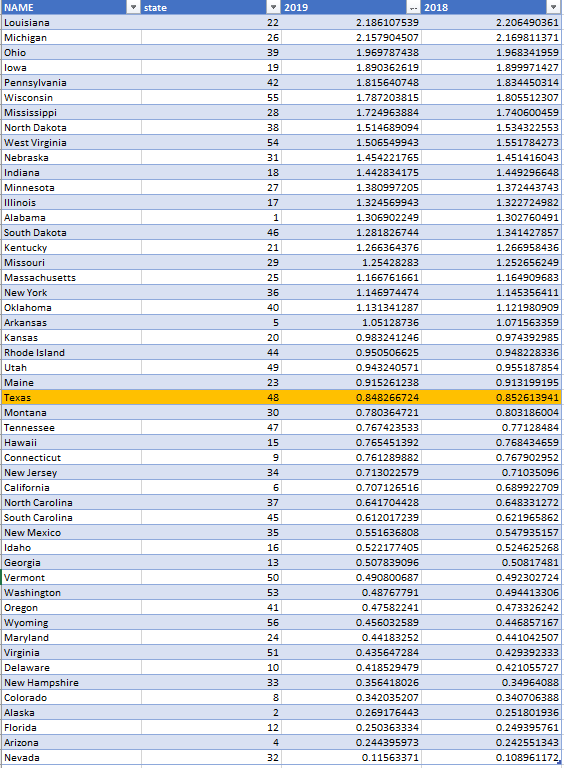

# Educational Attainment of Migrants vs Texas

Ratio of the number of bachelors degrees produced in state over the number of people with bachelors that were born out of state

## Workforce

### Goal: Jobs

Texans have the knowledge and skills to access careers enabling economic security

### Type: Secondary indicator

Updated: yes

Data Release Date:

----

Date: 

Comparisons: States

----

Date: 2019

Latest Value: .848 

State Rank: 26

Peer Rank: 

----

----

Previous Date: 2018

Previous Value: .853

Previous State Rank: 26

Previous Peer Rank: 

Previous Peer Rank: 

----
Metric Trend: flat

Target: 

Baseline: 

Target Value: 

Previous Trend: 

### Value

| Year |  Value      | Rank     | Previous Year   | Previous Value | Previous Rank | Trend | 
| ----------- | ----------- | ----------- | ----------- | ----------- | ----------- | -----------|
|     2019    |     .848    |     26      |    2018     |     .853    |     26      |     flat   | 

### Data

### Source

[Census]

### Notes

the ratio of the number of bachelors degrees produced in state over the number of people with bachelors that were born out of state.

### Indicator Page

N/A

### DataLab Page

N/A
