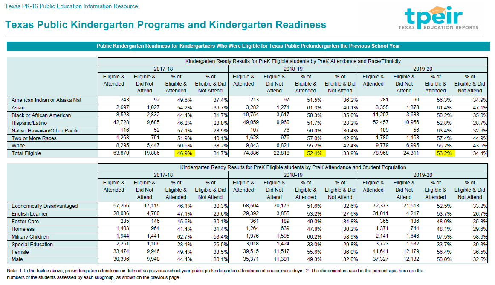

# Percent of eligible 3- and 4-year-olds enrolled in public Pre-K

## Education & Workforce

### Secondary Indicator

### **Goal**

Early childhood

Texas children get a strong early start to succeed in school and life

### Value

| Year |  Value      | Rank     | Previous Year   | Previous Value | Previous Rank | Trend | 
| ----------- | ----------- | ----------- | ----------- | ----------- | ----------- | -----------|
|             | 53.2%      | N/A         |             |    52.4%  | N/A         | 📈       | 

### Data

### Source
[TEA Pre-Kindergarten Report](https://www.texaseducationinfo.org/PickList.aspx?Page=Prekindergarten+Programs&ReportName=tpeir_pk_enroll_funds_state&PickList=School+Year&SubList=No&Title=Texas+Public+Prekindergarten+Programs+and+Enrollment+Ages+3+and+4+-+Statewide&Graph=N&from=Home%2fTopic%2fPrekindergarten+Programs)

### Notes:
Source Download is a file called CrystalReportViewer1.pdf which contains the variables.

[File Attachment](./CrystalReportViewer1.pdf)

### Indicator Page

[Indicator Link](https://indicators.texas2036.org/indicator/38)

### DataLab Page

[Pre-K Enrollment](https://datalab.texas2036.org/USECVITN2017R/texas-2036?accesskey=uxfcvbg)
