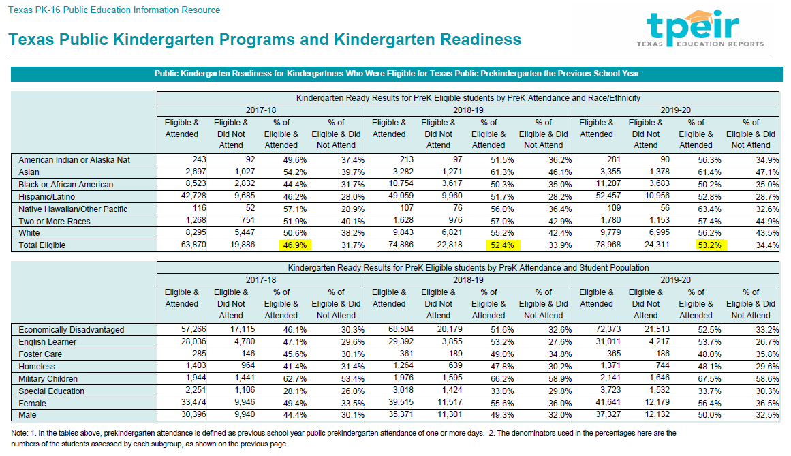

# Enrollment in public Pre-K

Percent of eligible 3- and 4-year-olds enrolled in public Pre-K

## Education

### Goal: Early childhood

Texas children get a strong early start to succeed in school and life

### Type: Secondary indicator

Updated: yes

Data Release Date: 

Comparisons: Texas

----

Date: 2020

Latest Value: 53.2% 

State Rank: N/A (Texas Only variable)

Peer Rank: N/A

----

Previous Date: 2019

Previous Value: 52.4%

Previous State Rank: N/A

Previous Peer Rank: 

----
Metric Trend: up

Target: 

Baseline: 

Target Value: 

Previous Trend: 

<!--### Value

| Year |  Value      | Rank     | Previous Year   | Previous Value | Previous Rank | Trend | 
| ----------- | ----------- | ----------- | ----------- | ----------- | ----------- | -----------|
|    2020     | 53.2%      | N/A         |   2019      |    52.4%  | N/A         | up       | 

-->
### Data

### Source
[TEA Pre-Kindergarten Report](https://www.texaseducationinfo.org/PickList.aspx?Page=Prekindergarten+Programs&ReportName=tpeir_pk_enroll_funds_state&PickList=School+Year&SubList=No&Title=Texas+Public+Prekindergarten+Programs+and+Enrollment+Ages+3+and+4+-+Statewide&Graph=N&from=Home%2fTopic%2fPrekindergarten+Programs)

### Notes:
Source Download is a file called CrystalReportViewer1.pdf which contains the variables.

[File Attachment](./CrystalReportViewer1.pdf)

### Indicator Page

[Indicator Link](https://indicators.texas2036.org/indicator/38)

### DataLab Page

[Pre-K Enrollment](https://datalab.texas2036.org/USECVITN2017R/texas-2036?accesskey=uxfcvbg)
