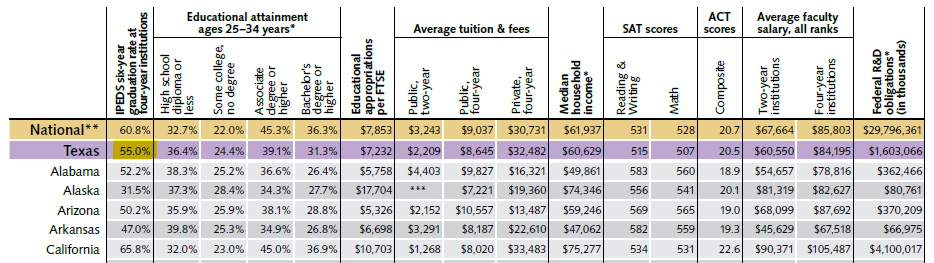
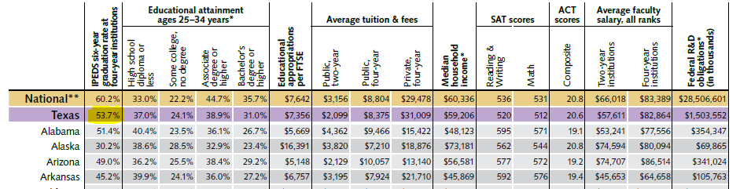

# Postsecondary completion

Percent of high school graduates who earned a certificate or degree from a Texas phei within 6 years of high school graduation

## Education

### Goal: Postsecondary

Texas students earn a postsecondary credential to access the jobs of today and tomorrow

### Primary Indicator

Updated: yes

Data Release Date: 

Comparisons: States

----

Date: 2020

Latest Value: 55.0%

State Rank: 31

Peer Rank: 

----

Previous Date: 2019

Previous Value: 53.7%

Previous State Rank:  31 

Previous Peer Rank: 

----
Metric Trend: flat

Target: 

Baseline: 32%

Target Value: 80%

Previous Trend: flat

### Value

| Year |  Value      | Rank     | Previous Year   | Previous Value | Previous Rank | Trend | 
| ----------- | ----------- | ----------- | ----------- | ----------- | ----------- | -----------|
|   2020     | 55.0%      |     31   |     2019    |    53.7%  | 31        | flat       | 

### Data

2020

2019

### Source

[Texas Higher Education Almanac - 2020](http://reportcenter.highered.texas.gov/agency-publication/almanac/2020-texas-public-higher-education-almanac/)

### Notes

### Indicator Page

N/A

### DataLab Page

N/A
