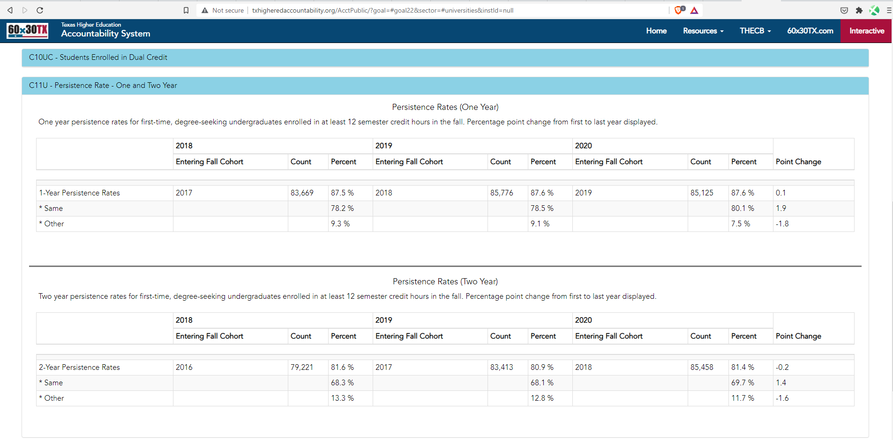

# Percent of high school graduates who enrolled in a Texas phei the fall semester following high school graduation and returned

## Education & Workforce

### Secondary Indicator

### **Goal**

Postsecondary

Texas students earn a postsecondary credential to access the jobs of today and tomorrow

### Value

| Year |  Value      | Rank     | Previous Year   | Previous Value | Previous Rank | Trend | 
| ----------- | ----------- | ----------- | ----------- | ----------- | ----------- | -----------|
|             | 87.6%      |    N/A  |             |    87.6%  | N/A         | flat       | 

### Data

### Source
[Texas Higher Ed Accountability](http://www.txhigheredaccountability.org/AcctPublic/Measures/ManageMeasures?instTypeID=1)

### Notes

### Indicator Page

N/A

### DataLab Page

N/A