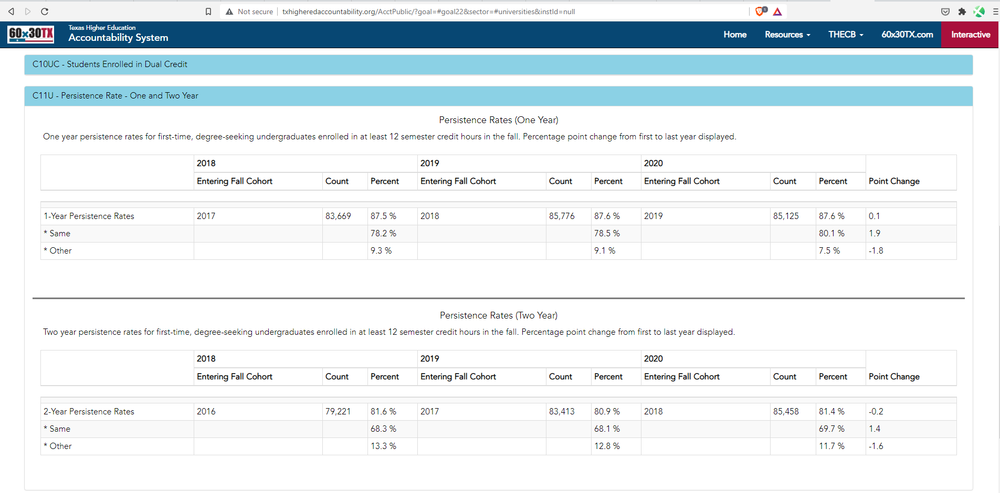

# ​​Postsecondary persistence

Percent of high school graduates who enrolled in a Texas phei the fall semester following high school graduation and returned

## Education

### Goal: Postsecondary

Texas students earn a postsecondary credential to access the jobs of today and tomorrow

### Type: Secondary indicator

Updated: yes

Data Release Date: 

Comparisons: Texas

----

Date: 2020

Latest Value: 87.6% 

State Rank: N/A

Peer Rank: 

----

Previous Date: 2019

Previous Value: 87.6%

Previous State Rank: N/A

Previous Peer Rank: 

----
Metric Trend: flat

Target: 

Baseline: 

Target Value: 

Previous Trend: 

<!--### Value

| Year |  Value      | Rank     | Previous Year   | Previous Value | Previous Rank | Trend | 
| ----------- | ----------- | ----------- | ----------- | ----------- | ----------- | -----------|
|    2020     | 87.6%      |    N/A  |    2019     |    87.6%  | N/A         | flat       | 

-->
### Data

### Source
[Texas Higher Ed Accountability](http://www.txhigheredaccountability.org/AcctPublic/Measures/ManageMeasures?instTypeID=1)

### Notes

### Indicator Page

N/A

### DataLab Page

N/A
