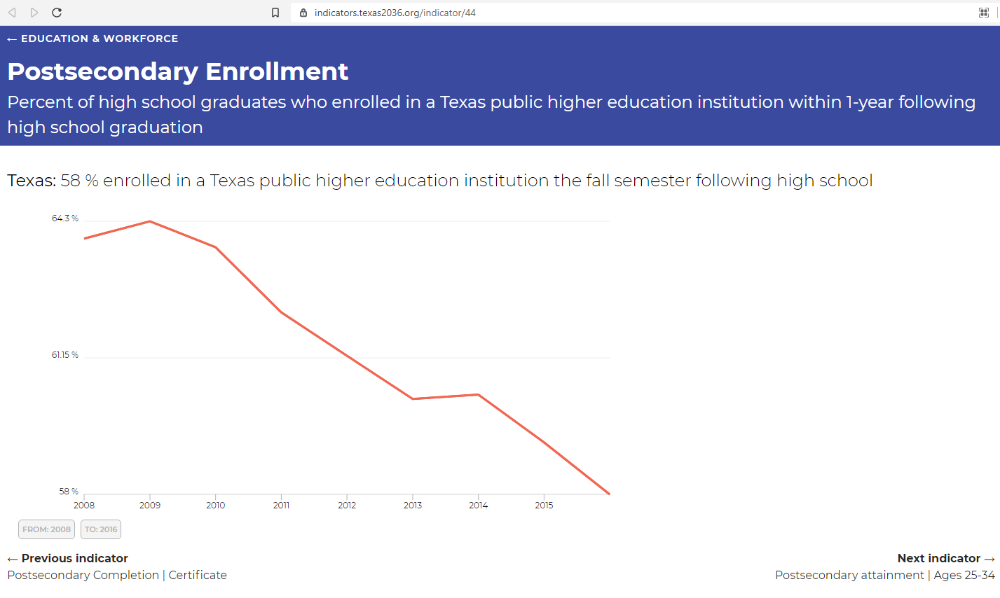
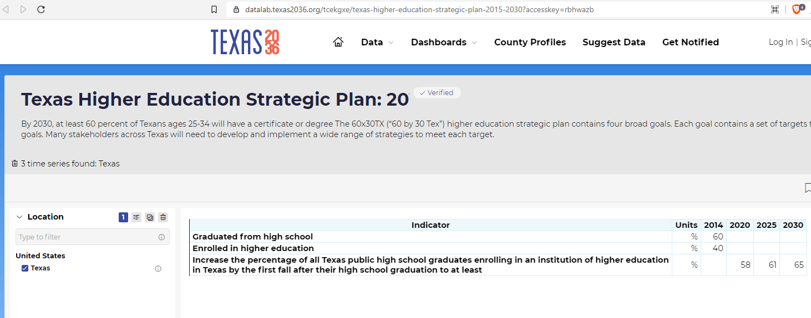

# Percent of high school graduates who enrolled in a Texas phei the fall semester following high school graduation

## Education & Workforce

### Secondary Indicator

### **Goal**

Postsecondary

Texas students earn a postsecondary credential to access the jobs of today and tomorrow

### Value

| Year |  Value      | Rank     | Previous Year   | Previous Value | Previous Rank | Trend | 
| ----------- | ----------- | ----------- | ----------- | ----------- | ----------- | -----------|
|             | 51.6%      |    N/A  |             |    52.3%  | N/A         | down       | 

### Data

2020

2019

### Source
[Texas Higher Education Almanac - 2020](http://reportcenter.highered.texas.gov/agency-publication/almanac/2020-texas-public-higher-education-almanac/)

### Notes

### Indicator Page

[Indicator Link](https://indicators.texas2036.org/indicator/44)

### DataLab Page

Doesn't match:

[DataLab - Strategic Plan](https://datalab.texas2036.org/tcekgxe/texas-higher-education-strategic-plan-2015-2030?accesskey=rbhwazb)

