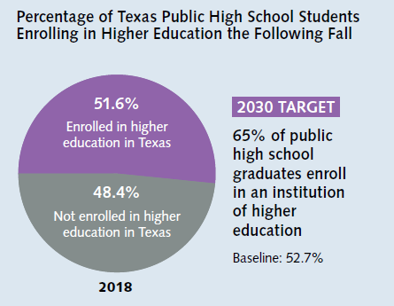

# Percent of high school graduates who enrolled in a Texas phei the fall semester following high school graduation

## Education & Workforce

### Value

|  Value      | Rank        | Previous Value | Previous Rank | Trend | 
| ----------- | ----------- | ----------- | ----------- | -----------|
| 51.6%      |    N/A  |    52.3%  | N/A         | down       | 

### Data

2020

2019

### Source
[Texas Higher Education Almanac - 2020](http://reportcenter.highered.texas.gov/agency-publication/almanac/2020-texas-public-higher-education-almanac/)

### Notes: