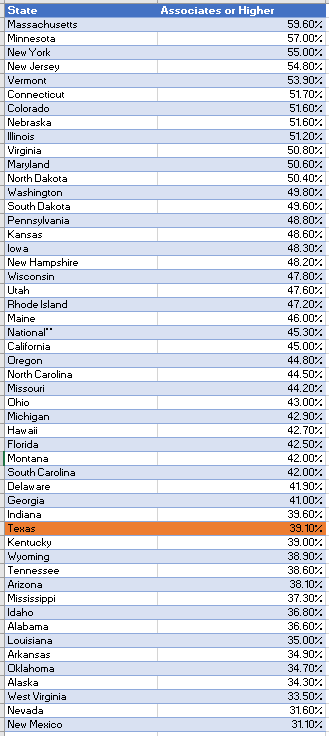
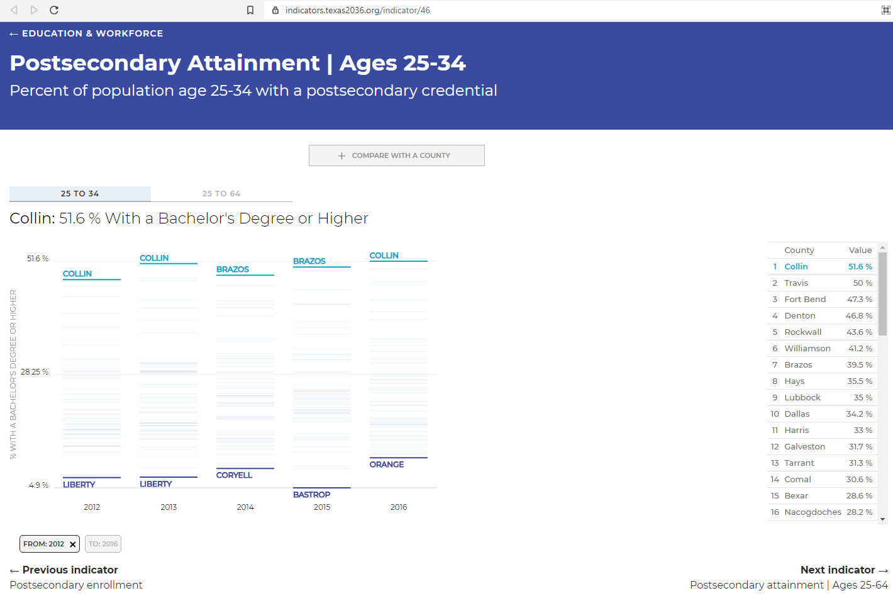
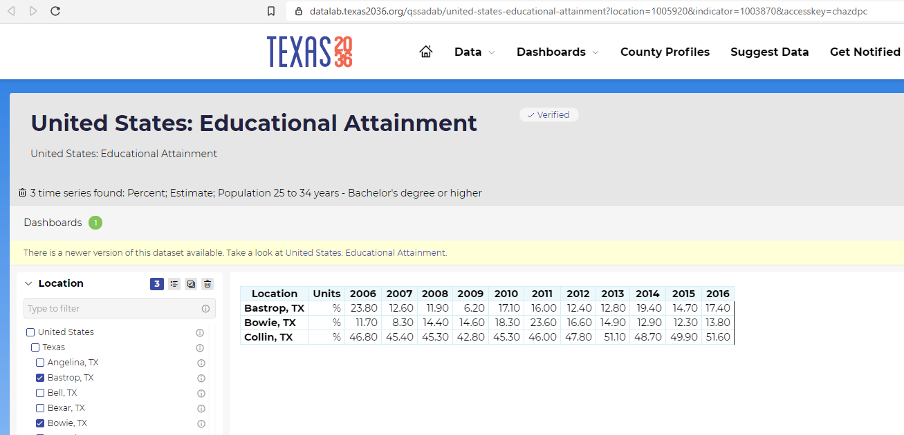

# Percent of population age 25-34 with a postsecondary credential

## Education & Workforce

### Secondary Indicator

### **Goal**

Jobs

Texans have the knowledge and skills to access careers enabling economic security

### Value

| Year |  Value      | Rank     | Previous Year   | Previous Value | Previous Rank | Trend | 
| ----------- | ----------- | ----------- | ----------- | ----------- | ----------- | -----------|
|     2020    | 39.1%       |     36      |    2019     |    38.9     | 36          | flat       | 

### Data

 

### Source

[Texas Higher Education Almanac - 2020](http://reportcenter.highered.texas.gov/agency-publication/almanac/2020-texas-public-higher-education-almanac/)

### Notes
Defined as Associate's Degree or higher.

### Indicator Page

[Indicator Link](https://indicators.texas2036.org/indicator/46)

### DataLab Page

[DataLab Link](https://datalab.texas2036.org/qssadab/united-states-educational-attainment?location=1005920&indicator=1003870&accesskey=chazdpc)

