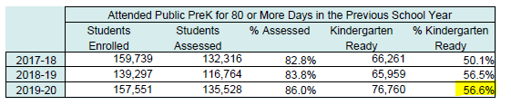
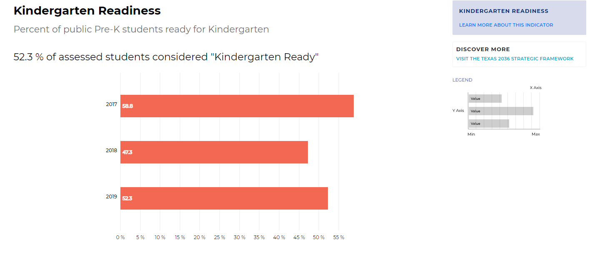
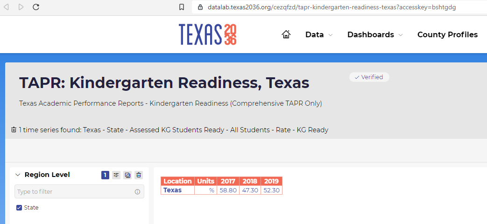

# Kindergarten readiness

Percent of public Pre-K students ready for Kindergarten

## Education

### Goal: Early childhood

Texas children get a strong early start to succeed in school and life

### Type: Secondary indicator

Updated: yes

Data Release Date: 

Comparisons: Texas

----

Date: 2020

Latest Value: 56.6% 

State Rank: N/A

Peer Rank: 

----

Previous Date: 2019

Previous Value: 56.5%

Previous State Rank: N/A

Previous Peer Rank: 

----
Metric Trend: flat

Target: 

Baseline: 

Target Value: 

Previous Trend: 

### Value

| Year |  Value      | Rank     | Previous Year   | Previous Value | Previous Rank | Trend | 
| ----------- | ----------- | ----------- | ----------- | ----------- | ----------- | -----------|
|    2020     | 56.6%       |     N/A      |     2019    |    56.5%     | N/A          | flat     |

### Data

### Source
[Kindergarten Readiness Report](./CrystalReportViewer1.pdf)

### Notes

### Indicator Page

[Indicator Link](https://indicators.texas2036.org/indicator/37)

### DataLab Page

[DataLab Link](https://datalab.texas2036.org/cezqfzd/tapr-kindergarten-readiness-texas?accesskey=bshtgdg)

