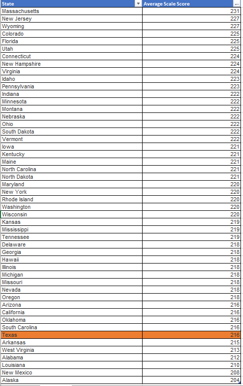
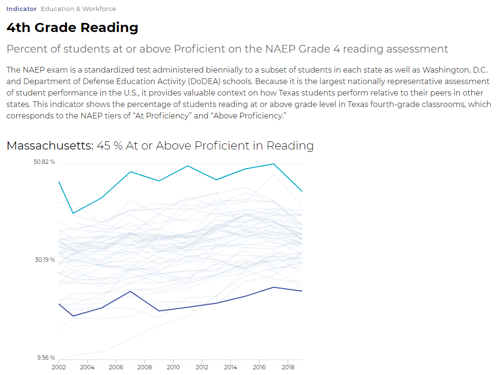
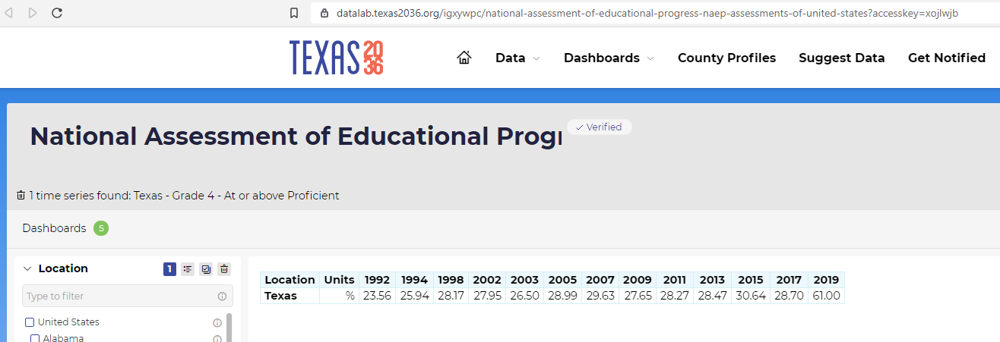

# 4rd grade reading

Percent of students at or above Proficient on the NAEP Grade 4 reading assessment

## Education

### Goal: Early childhood

Texas children get a strong early start to succeed in school and life

### Type: Primary indicator

Updated: yes

Data Release Date: 

Comparisons: States

----

Date: 2019

Latest Value: 30

State Rank: 44

Peer Rank: 12

----

Previous Date: 2017

Previous Value: 29%

Previous State Rank: 45

Previous Peer Rank: 12

----
Metric Trend: up

Target: Top 3

Baseline: 30%

Target Value: 38%

Previous Trend: Flat

### Value

| Year        |  Value      | Rank        | Previous Year| Previous Value| Previous Rank  | Trend | 
| ----------- | ----------- | ----------- | ----------- | ----------- | ----------- | -----------|
|    2019     |    30%      | 42          |      2017   |   29%       |    45       |    up      | 

### **Data**

### **Source**

[NAEP](https://www.nationsreportcard.gov/profiles/stateprofile?chort=1&sub=RED&sj=AL&sfj=NP&st=AP&year=2019R3)

[NAEP](https://www.nationsreportcard.gov/ndecore/xplore/NDE)

[NAEP Map](https://www.nationsreportcard.gov/reading/states/scores/?grade=4)

### **Notes**
NAEP Assessment is every 2 years (previous was 2019)

### Indicator Page

[Indicator Page](https://indicators.texas2036.org/indicator/35)

### DataLab Page

[DataLab Link](https://datalab.texas2036.org/igxywpc/national-assessment-of-educational-progress-naep-assessments-of-united-states?accesskey=xojlwjb)

