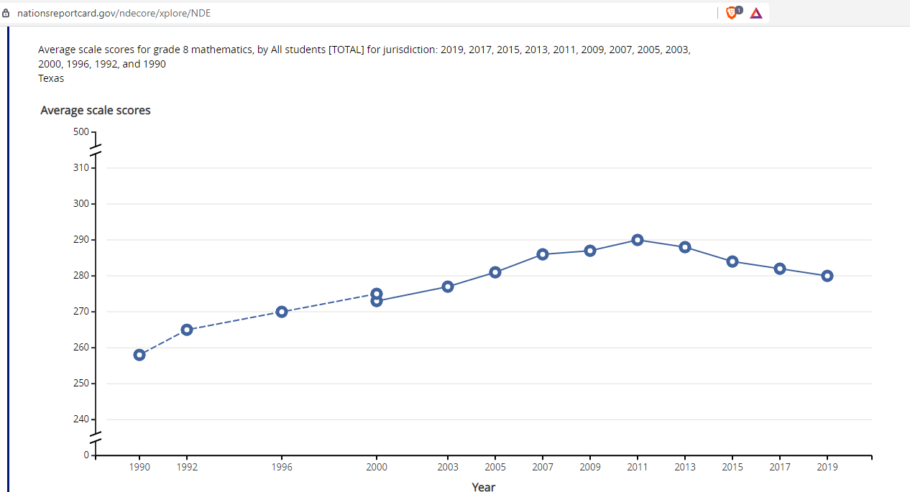
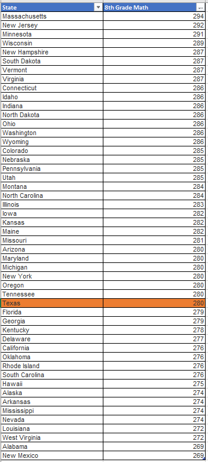
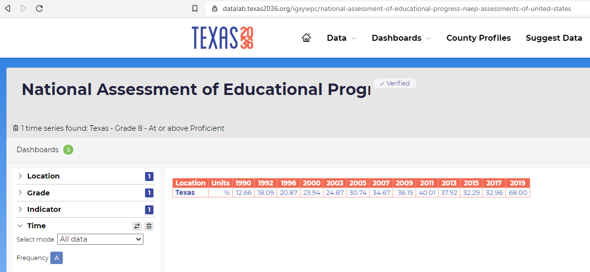

# 8th grade math

Percent of students at or above Proficient on the NAEP Grade 8 math assessment

## Education

### Goal: K-12

Texas students graduate high school ready for postsecondary success

### Type: Secondary indicator

Updated: yes

Data Release Date: 

Comparisons: States

----

Date: 2019

Latest Value: 30

State Rank: 34

Peer Rank: 11

----

Previous Date: 2017

Previous Value: 33%

Previous State Rank: 24

Previous Peer Rank: 

----
Metric Trend: down

Target: 

Baseline: 

Target Value: 

Previous Trend: 

<!--### Value

| Year |  Value      | Rank     | Previous Year   | Previous Value | Previous Rank | Trend | 
| ----------- | ----------- | ----------- | ----------- | ----------- | ----------- | -----------|
|   2019      |     30%     | 32          |    2017     |    33%      | 24          |   down     | 

### **Data**

### **Source**

[NAEP](https://www.nationsreportcard.gov/ndecore/xplore/NDE)

[NAEP Map](https://www.nationsreportcard.gov/mathematics/states/achievement/?grade=8)

### **Notes**
NAEP Assessment is every 2 years (previous was 2019)

Average Scale Score

-->
### DataLab 

[DataLab Link](https://datalab.texas2036.org/igxywpc/national-assessment-of-educational-progress-naep-assessments-of-united-states)

### Indicator Page

[Indicator Page](https://indicators.texas2036.org/indicator/42)

### Strategic Framework

