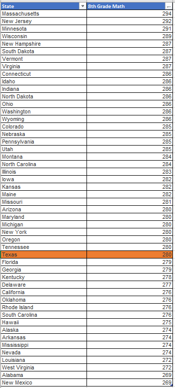

# 8th grade math

## Education & Workforce 

### Secondary Indicator

### **Goal**

K-12

Texas students graduate high school ready for postsecondary success

### Value

| Year |  Value      | Rank     | Previous Year   | Previous Value | Previous Rank | Trend | 
| ----------- | ----------- | ----------- | ----------- | ----------- | ----------- | -----------|
|   2019      |     280     | N/A         |    2017     |    282      | N/A         | 📈     | 

### **Data**

### **Source**

[NAEP](https://www.nationsreportcard.gov/ndecore/xplore/NDE)

[NAEP Map](https://www.nationsreportcard.gov/mathematics/states/achievement/?grade=8)

### **Notes**
NAEP Assessment is every 2 years (previous was 2019)

Average Scale Score

### DataLab 

[DataLab Link](https://datalab.texas2036.org/igxywpc/national-assessment-of-educational-progress-naep-assessments-of-united-states)

### Indicator Page

[Indicator Page](https://indicators.texas2036.org/indicator/42)

### Strategic Framework

