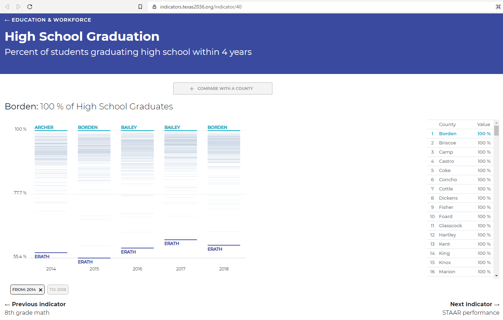
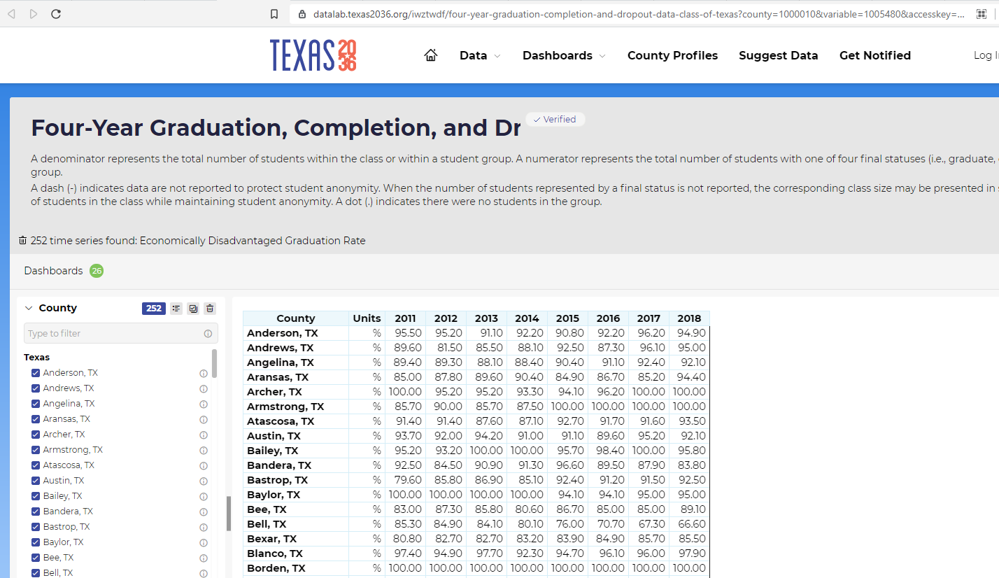

# High school graduation

Percent of students graduating high school within 4 years

## Education

### Goal: K-12

Texas students graduate high school ready for postsecondary success

### Type: Secondary indicator

Updated: yes

Data Release Date: 

Comparisons: States

----

Date: 2020

Latest Value: 90% 

State Rank: N/A

Peer Rank: 

----

Previous Date: 2019

Previous Value: 90%

Previous State Rank: N/A

Previous Peer Rank: 

----
Metric Trend: flat

Target: 

Baseline: 

Target Value: 

Previous Trend: 

### Value

| Year |  Value      | Rank     | Previous Year   | Previous Value | Previous Rank | Trend | 
| ----------- | ----------- | ----------- | ----------- | ----------- | ----------- | -----------|
|   2020      | 90%       |     N/A      |    2019     |    90%     | N/A          | flat   |

### Data

### Source
TAPR

SCOMP4 (Table)

State 4-Year Longitudinal Rate

SAGC4X19R (Variable)

State 2019 4-Year Longitudinal: (Graduates) for All Students Rate

### Notes

### Indicator Page

[Indicator Link](https://indicators.texas2036.org/indicator/40)

### DataLab Page

[DataLab Link](https://datalab.texas2036.org/iwztwdf/four-year-graduation-completion-and-dropout-data-class-of-texas?county=1000010&variable=1005480&accesskey=dxanhyf)

