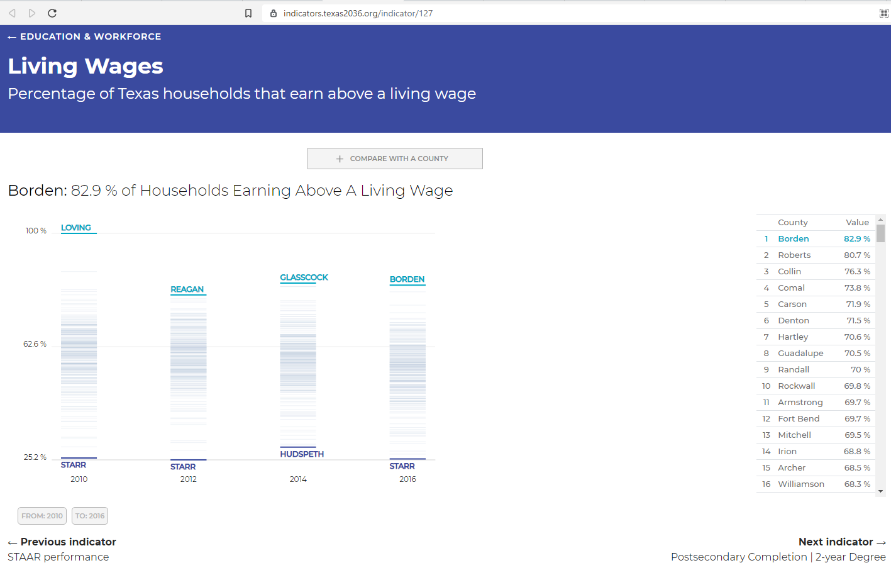

# Living wages

Percent of working population earning a mid- or high-wage

## Workforce

### Goal: Jobs

Texans have the knowledge and skills to access careers enabling economic security

### Type: Primary indicator

Updated: no

Data Release Date: 

Comparisons: States

----

Date: 2020

Latest Value:  

State Rank: N/A

Peer Rank: 

----

Previous Date: 2019

Previous Value: 

Previous State Rank: N/A

Previous Peer Rank: 10

----
Metric Trend: 

Target: Top 3

Baseline: 58%

Target Value: 60%

Previous Trend: 

### Value

| Year |  Value      | Rank     | Previous Year   | Previous Value | Previous Rank | Trend | 
| ----------- | ----------- | ----------- | ----------- | ----------- | ----------- | -----------|
|   2020      |         | N/A         |    2019     |         | N/A         |           | 

### Data

### Source
[United Way - ALICE Report](2020ALICEReport_TX_FINAL.pdf)

[Previous Source](https://www.brookings.edu/research/meet-the-low-wage-workforce/)

### Notes

The average ALICE Household Survival Budget in Texas was $22,320 for a single adult,
$25,392 for a single senior, and $64,512 for a family of four in 2018 — significantly
more than the Federal Poverty Level of $12,140 for a single adult and $25,100 for a
family of four.

### Indicator Page

[Indicator Link](https://indicators.texas2036.org/indicator/127)

### DataLab Page

N/A

