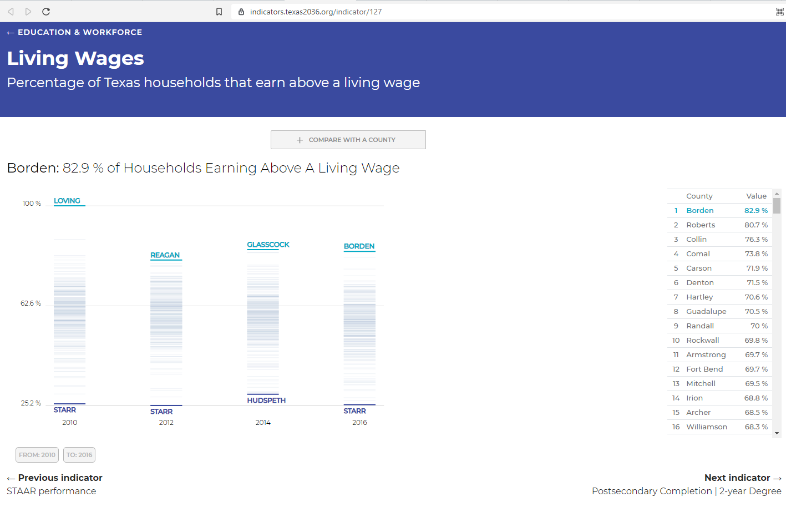

# Percent of Population earning a mid- or high-wage

## Education & Workforce

### Primary Indicator

### **Goal**

Jobs

Texans have the knowledge and skills to access careers enabling economic security

### Value

|  Value      | Rank        | Previous Value | Previous Rank | Trend | 
| ----------- | ----------- | ----------- | ----------- | -----------|
|         | N/A         |         | N/A         |   📈       | 

### Data

### Source
[United Way - ALICE Report](2020ALICEReport_TX_FINAL.pdf)

[Previous Source](https://www.brookings.edu/research/meet-the-low-wage-workforce/)

### Notes

The average ALICE Household Survival Budget in Texas was $22,320 for a single adult,
$25,392 for a single senior, and $64,512 for a family of four in 2018 — significantly
more than the Federal Poverty Level of $12,140 for a single adult and $25,100 for a
family of four.

### Indicator Page

[Indicator Link](https://indicators.texas2036.org/indicator/127)

### DataLab Page

N/A

