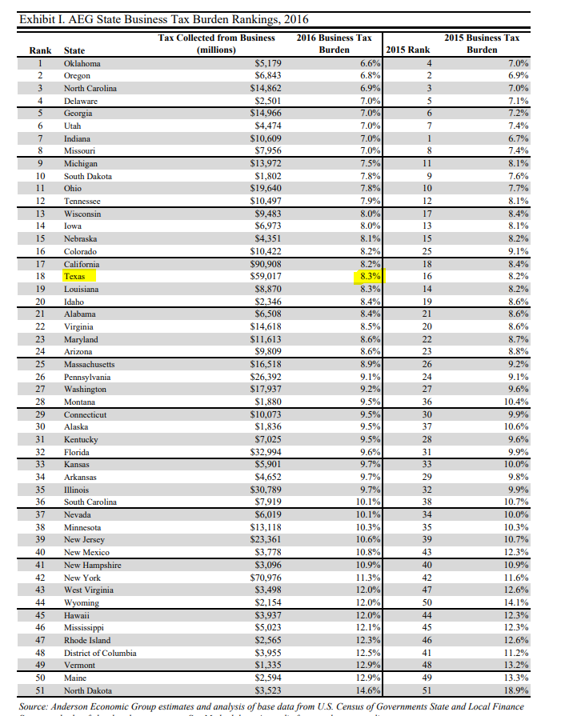

# Business tax burden

Combined state and local taxes by business as percent of pre-tax gross operation margin

## Fiscal Sustainability

### Goal: Broad stable revenue base

Texas people and businesses contribute taxes and fees to meet strategic needs and remain competitive as we grow and change

### Type: Primary indicator

Updated: yes

Data Release Date: 

Comparisons: States

### Value

| Year      |  Value      | Rank        | Previous Year | Previous Value | Previous Rank | Trend | 
| ----------- | ----------- | ----------- | ----------- | ----------- | ----------- | -----------|
|   2016      |    8.31%    |      18     |    2015     |    8.2%     |      16     |    flat    | 

### Data

### Source

[State and Local Tax Burden](https://taxfoundation.org/publications/state-local-tax-burden-rankings/)

[Anderson Economic Group](https://www.andersoneconomicgroup.com/reports-articles-and-working-papers/state-business-tax-rankings/)

[2018 State Business Tax Burden Rankings](https://www.andersoneconomicgroup.com/wp-content/uploads/AEGBusinessTaxBurdenStudy_2018_FINAL.pdf)

[2017 State Business Tax Burden Rankings](https://www.andersoneconomicgroup.com/Portals/0/AEG%20Tax%20Burden%20Study_2017_FINAL.pdf)

[WalletHub](https://wallethub.com/edu/states-with-highest-lowest-tax-burden/20494)

### Notes

### Indicator Page

[Indicator Link](https://indicators.texas2036.org/indicator/140)

### DataLab Page

N/A