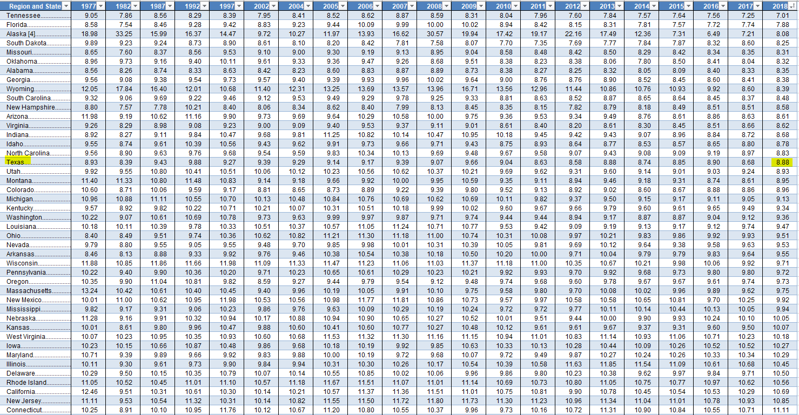

# Individual tax burden

Combined state and local taxes by individuals as percent of income

## Fiscal Sustainability

### Goal: Broad stable revenue base

Texas people and businesses contribute taxes and fees to meet strategic needs and remain competitive as we grow and change

### Type: Primary indicator

Updated: yes

Data Release Date: October 21, 2020

Comparisons: States

----

Date: 2021

Latest Value: 7.88

State Rank: 45

Peer Rank: 11

----

Previous Date:  2020

Previous Value: 7.9

Previous State Rank:   11

Previous Peer Rank: 11

Metric Trend: flat

Target: Top 3

Baseline: 

Target Value: N/A

Previous Trend: Worsening

### Value

| Year      |  Value      | Rank        | Previous Year | Previous Value | Previous Rank | Trend | 
| ----------- | ----------- | ----------- | ----------- | ----------- | ----------- | -----------|
|   2018       |    8.88%    |    17      |    2017     |   8.68%     |    15       |  flat     | 

### Data

### Source

[Tax Foundation](https://taxfoundation.org/2021-state-business-tax-climate-index/)

<!-- [Wallet Hub](https://wallethub.com/edu/states-with-highest-lowest-tax-burden/20494)

[Tax Policy Center](https://www.taxpolicycenter.org/statistics/state-and-local-tax-revenue-percentage-personal-income)

[tpc](https://www.taxpolicycenter.org/statistics/state-and-local-tax-revenue-percentage-personal-income) -->

### Notes

### Indicator Page

[Indicator Link](https://indicators.texas2036.org/indicator/117)

### DataLab Page

N/A
