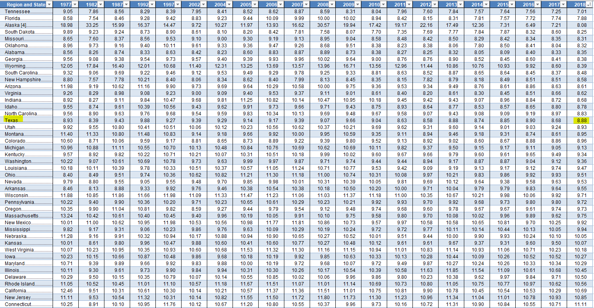

# Individual tax burden

Combined state and local taxes by individuals as percent of income

## Fiscal Sustainability

### Goal: Broad, stable revenue base

Texas people and businesses contribute taxes and fees to meet strategic needs and remain competitive as we grow and change

### Type: Primary indicator

Updated: yes

Data Release Date: 

Comparisons: States

### Value

| Year      |  Value      | Rank        | Previous Year | Previous Value | Previous Rank | Trend | 
| ----------- | ----------- | ----------- | ----------- | ----------- | ----------- | -----------|
|   2018       |    8.88%    |    17      |    2017     |   8.68%     |    15       |  flat     | 

### Data

### Source

[Tax Policy Center](https://www.taxpolicycenter.org/statistics/state-and-local-tax-revenue-percentage-personal-income)

### Notes

### Indicator Page

[Indicator Link](https://indicators.texas2036.org/indicator/117)

### DataLab Page

N/A