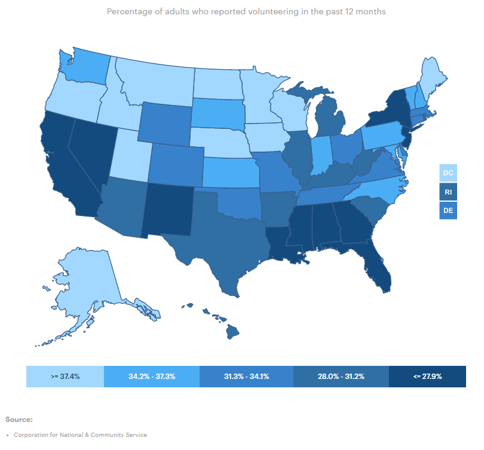
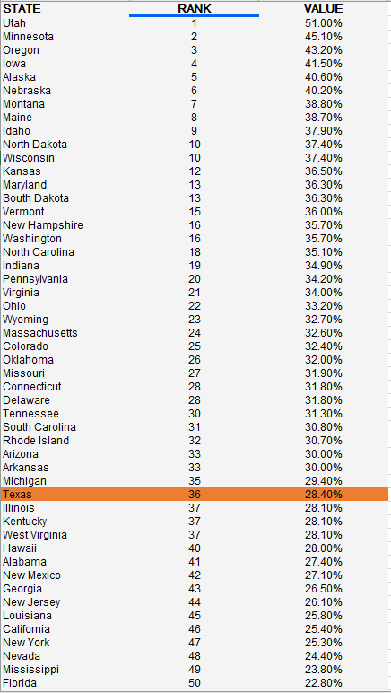

# Volunteerism

Percent of adults who volunteer

## Engagement

### Goal: Civic engagement

Texans actively participate in governing their communities

### Type: Secondary indicator

Updated: yes

Data Release Date: 

Comparisons: States

Date: 2020

Latest Value: 28.4% 

State Rank: 36

Peer Rank: 

Previous Date: N/A

Previous Value: N/A

Previous State Rank: N/A

Metric Trend: flat

Target: 

Baseline: 

Previous Target Value: 

Previous Trend: 

Previous Peer Rank: 

Previous State Rank (og): 

### Value

| Year      |  Value      | Rank        | Previous Year | Previous Value | Previous Rank | Trend | 
| ----------- | ----------- | ----------- | ----------- | ----------- | ----------- | -----------|
|   2020       | 28.4%       |  36         |      N/A   |   N/A      |      N/A    |    flat       | 

### Data

### Source

[AmericasHealthRankings](https://www.americashealthrankings.org/explore/annual/measure/volunteerism/state/TX)

### Notes

### Indicator Page

N/A

### DataLab Page

N/A