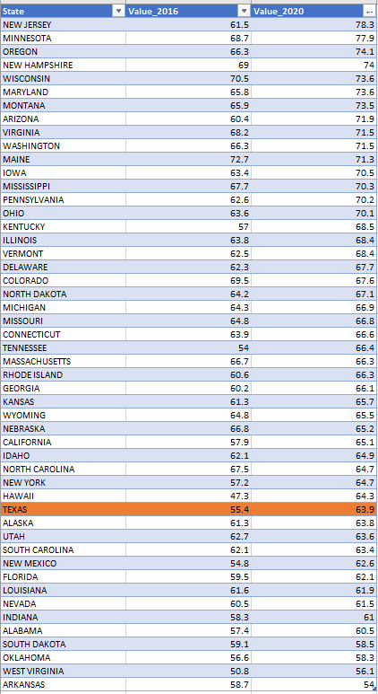

# Voter participation

Percent of voting-age population who vote in major elections

## Engagement

### Goal: Civic engagement

Texans actively participate in governing their communities

### Type: Primary indicator

Updated: yes

Data Release Date: 

Comparisons: States

----

Date: 2020

Latest Value: 63.9%

State Rank: 37

Peer Rank: 11

----

Previous Date:  2016

Previous Value: 55.4%

Previous State Rank: 46

Previous Peer Rank: 12

----
Metric Trend: up

Target: Top 9

Baseline: 48.4

Target Value: 53%

Previous Trend: Improving

<!-- 
### Value

| Year      |  Value      | Rank        | Previous Year | Previous Value | Previous Rank | Trend | 
| ----------- | ----------- | ----------- | ----------- | ----------- | ----------- | -----------|
|   2020       |    60.4%   |      44     |    2016     |    51.1%     |     46     |   up       |  -->

### Data

### Source

[census - 2020](https://www.census.gov/data/tables/time-series/demo/voting-and-registration/p20-585.html)

[census - 2016](https://www.census.gov/data/tables/time-series/demo/voting-and-registration/p20-580.html)

[Census](https://www.census.gov/topics/public-sector/voting.html)

[Statista - 2016 presidential election turnout](https://www.statista.com/statistics/632113/2016-us-presidential-election-voter-turnout-by-state/)

[Statista - 2020 presidential election turnout](https://www.statista.com/statistics/1184621/presidential-election-voter-turnout-rate-state/)

### Notes

Using the 2016 & 2020 Presidential Elections.

### Indicator Page

[Indicator Link](https://indicators.texas2036.org/indicator/120)

### DataLab Page

[DataLab Link](https://datalab.texas2036.org/jisgbgg/u-s-election-historical-reported-voting-rates?accesskey=gaeexyb)
