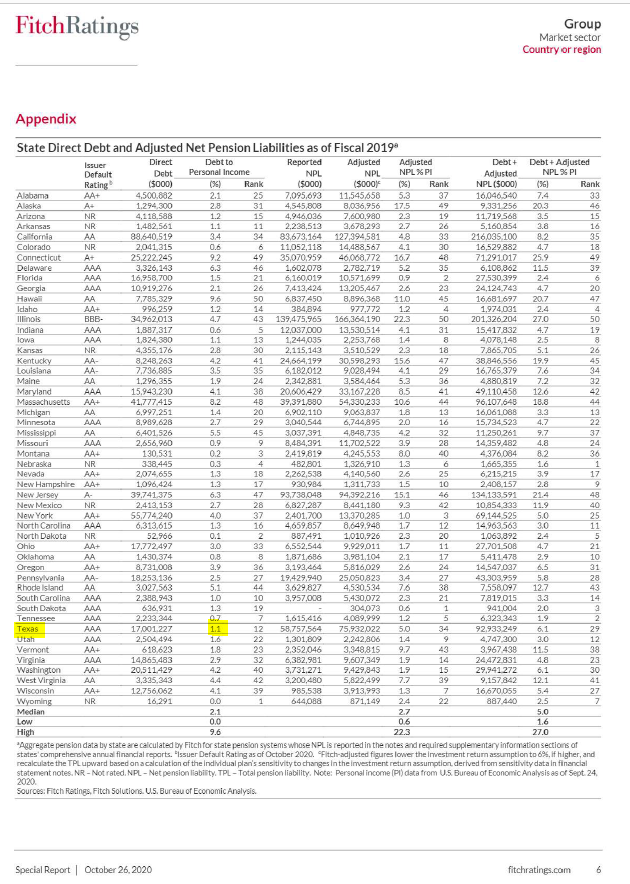

# Long-Term Liabilities

Tax-Supported Debt and Net Pension Liabilities as a Percentage of Total State Personal Income

## Fiscal Sustainability

### Goal: Wisely managed state spending

Texas strategically manages state expenditures to deliver the best value to taxpayers

### Type: Primary indicator

Updated: yes

Data Release Date: October 2020

Comparisons: States

----

Date: 2019

Latest Value: 6.1

State Rank: 29

Peer Rank: 9

----

Previous Date: 2018

Previous Value:

Previous State Rank: 

Previous Peer Rank: 

----
Metric Trend: flat

Target: Top 3

Baseline: 7.10%

Target Value: 5.20%

Previous Trend: Improving

### Value

| Year |  Value      | Rank     | Previous Year   | Previous Value | Previous Rank | Trend | 
| ----------- | ----------- | ----------- | ----------- | ----------- | ----------- | -----------|
|   2019      |     1.1%    |      12     |             |             | N/A         |          | 

### Data

### Source

[Fitch](https://www.grsconsulting.com/2020/10/28/fitch-ratings-releases-2020-state-liability-report/)

[Federal Reserve](https://www.federalreserve.gov/releases/z1/dataviz/household_debt/state/map/#year:2019)

[Pew](https://www.pewtrusts.org/en/research-and-analysis/data-visualizations/2019/a-tool-for-better-debt-comparisons)

[Texas - Debt Affordability Study 2021](http://www.brb.texas.gov/pub/bfo/DAS2021.pdf)

### Notes

This metric has a 2020 number, but it is behind a paywall at Fitch, so we need to pay for it. The value for 2019 is the Debt + Adjusted NPL - the far right column in the image above. 

### Indicator Page

### DataLab Page

