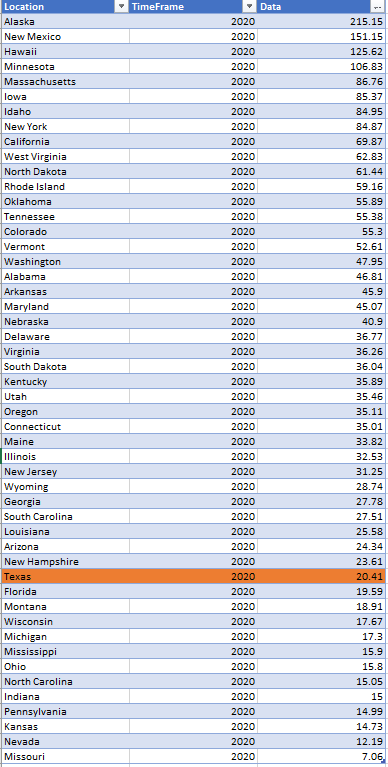
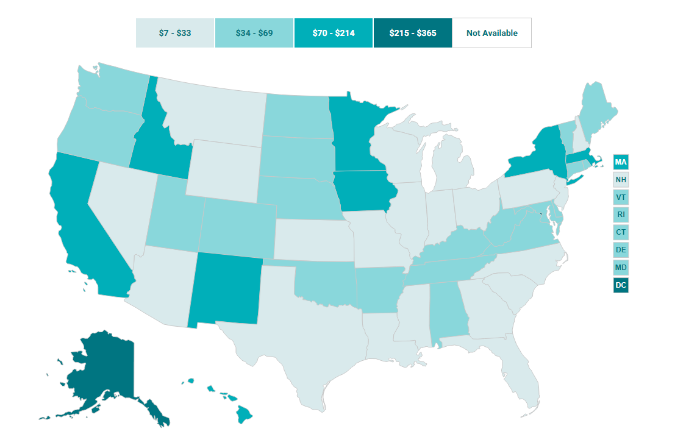

# Average annual percent increase in per person health care expenditures in Texas

## Health

### Primary Indicator

### **Goal**

Postsecondary

Texas students earn a postsecondary credential to access the jobs of today and tomorrow

### Value

|Year         |  Value      | Rank        | Previous Year| Previous Value | Previous Rank  | Trend| 
| ----------- | ----------- | ----------- | ----------- | ----------- | ----------- | -----------|
|    2020     |   $20.41    |     38      |    2019     |      $17.16    |      40    |   flat     |

### Data

### Source

[Shadac](http://statehealthcompare.shadac.org/map/117/per-person-state-public-health-funding#a/32/154)

### Notes

### Indicator Page

### DataLab Page

[DataLab Link](https://datalab.texas2036.org/korfwfb/per-capita-health-care-and-health-insurance-spendings-in-us?accesskey=tllvbld)