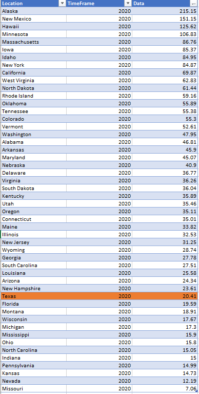
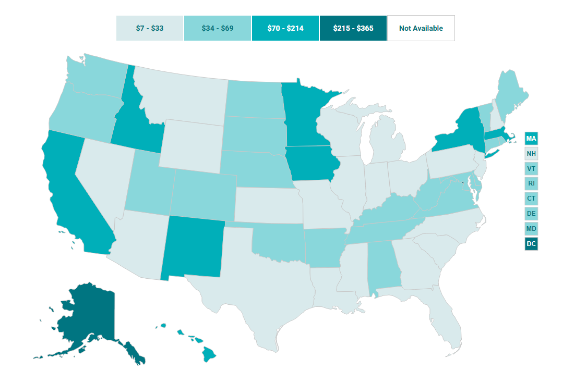

# Health care expenditure growth

Average annual percent increase in per person health care expenditures in Texas

## Health Outcomes

### Goal: Value-driven system

Texas has a high-value health care system that optimizes cost and delivers results

### Type: Primary indicator

Updated: no

Data Release Date: 

Comparisons: States

----

Date: N/A

Latest Value: N/A

State Rank: N/A

Peer Rank: N/A

----

Previous Date:  2014

Previous Value: 5.1%

Previous State Rank: 37

Previous Peer Rank: 7

----
Metric Trend: flat

Target: Top 3

Baseline: 5.1%

Target Value: 3.5%

Previous Trend: Improving

### Value

|Year         |  Value      | Rank        | Previous Year| Previous Value | Previous Rank  | Trend| 
| ----------- | ----------- | ----------- | ----------- | ----------- | ----------- | -----------|
|    2020     |   $20.41    |     38      |    2019     |      $17.16    |      40    |   flat     |

### Data

### Source

[Previous Source](https://www.cms.gov/Research-Statistics-Data-and-Systems/Statistics-Trends-and-Reports/NationalHealthExpendData/NationalHealthAccountsStateHealthAccountsResidence)

[Shadac](http://statehealthcompare.shadac.org/map/117/per-person-state-public-health-funding#a/32/154)

[KFF](https://www.kff.org/other/state-indicator/average-annual-percent-growth-in-health-care-expenditures-by-state-of-residence/?currentTimeframe=0&sortModel=%7B%22colId%22:%22Location%22,%22sort%22:%22asc%22%7D)

### Notes

Cannot find an updated number for this metric.

### Indicator Page

### DataLab Page

[DataLab Link](https://datalab.texas2036.org/korfwfb/per-capita-health-care-and-health-insurance-spendings-in-us?accesskey=tllvbld)
