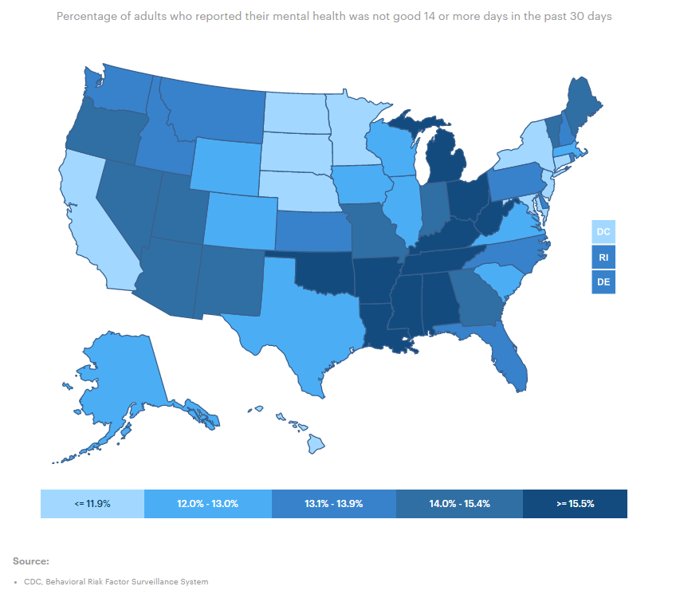
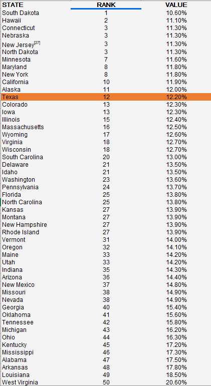

# Average number of mentally unhealthy days within the last 30 days reported by adults

## Health

### Primary Indicator

### Goal

Population health

Texans live long, healthy, and productive lives

### Value

| Year      |  Value      | Rank        | Previous Year | Previous Value | Previous Rank | Trend | 
| ----------- | ----------- | ----------- | ----------- | ----------- | ----------- | -----------|
|   2020       | 12.2%       |  12         |      2019   |   11.7%      |      15    |    up       | 

### Data

### Source

[AmericasHealthRankings](https://www.americashealthrankings.org/explore/annual/measure/mental_distress/state/TX)

### Notes

### Indicator Page

N/A

### DataLab Page

[DataLab Link](https://datalab.texas2036.org/bwhqgjc/behavioral-risk-factor-surveillance-system-brfss-prevalence-data?accesskey=bfuxtce)