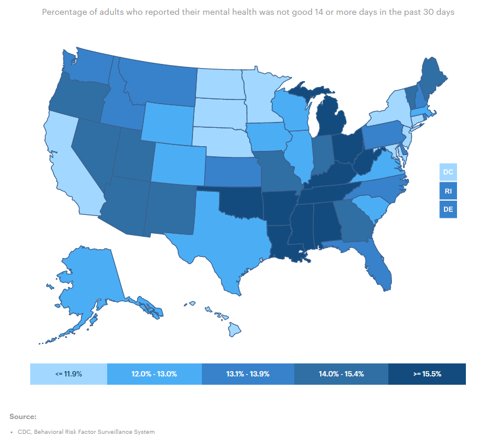
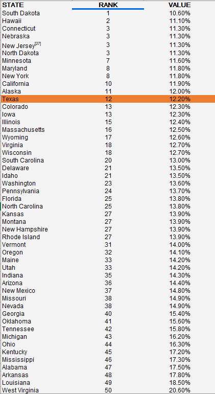

# Mentally unhealthy days

Average number of mentally unhealthy days within the last 30 days reported by adults

## Health Outcomes

### Goal: Public health

Texans live long, healthy, and productive lives

### Type: Secondary indicator

Updated: yes

Data Release Date: 

Comparisons: States

----

Date: 2020

Latest Value: 12.2% 

State Rank: 12

Peer Rank: 

----

Previous Date: 2019

Previous Value: 11.7%

Previous State Rank: 15

Previous Peer Rank: 

----
Metric Trend: up

Target: 

Baseline: 

Target Value: 

Previous Trend: 

### Value

| Year      |  Value      | Rank        | Previous Year | Previous Value | Previous Rank | Trend | 
| ----------- | ----------- | ----------- | ----------- | ----------- | ----------- | -----------|
|   2020       | 12.2%       |  12         |      2019   |   11.7%      |      15    |    up       | 

### Data

### Source

[AmericasHealthRankings](https://www.americashealthrankings.org/explore/annual/measure/mental_distress/state/TX)

### Notes

### Indicator Page

N/A

### DataLab Page

[DataLab Link](https://datalab.texas2036.org/bwhqgjc/behavioral-risk-factor-surveillance-system-brfss-prevalence-data?accesskey=bfuxtce)
