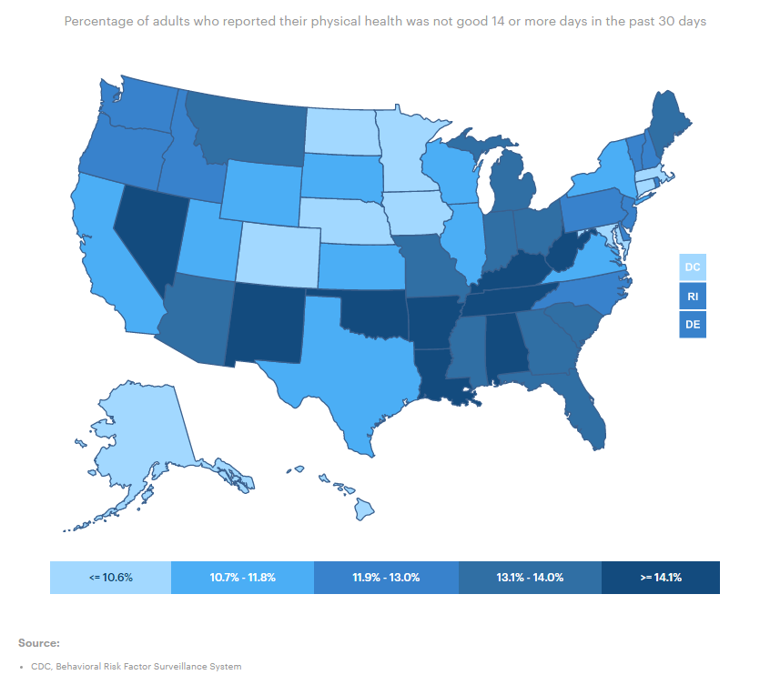
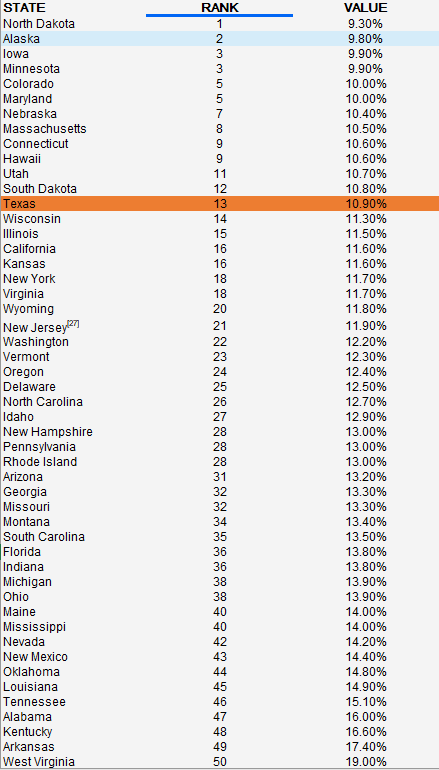

# Physically unhealthy days

Average number of physically unhealthy days within the last 30 days reported by adults

## Health Outcomes

### Goal: Public health

Texans live long, healthy, and productive lives

### Type: Secondary indicator

Updated: yes

Data Release Date: 

Comparisons: States

### Value

| Year      |  Value      | Rank        | Previous Year | Previous Value | Previous Rank | Trend | 
| ----------- | ----------- | ----------- | ----------- | ----------- | ----------- | -----------|
|   2020       | 10.9%       |  13         |      2019   |   11.8%      |      19    |    up       | 

### Data

### Source

[AmericasHealthRankings](https://www.americashealthrankings.org/explore/annual/measure/Physical_distress/state/TX)

### Notes

### Indicator Page

N/A

### DataLab Page

[DataLab Link](https://datalab.texas2036.org/bwhqgjc/behavioral-risk-factor-surveillance-system-brfss-prevalence-data?accesskey=bfuxtce)