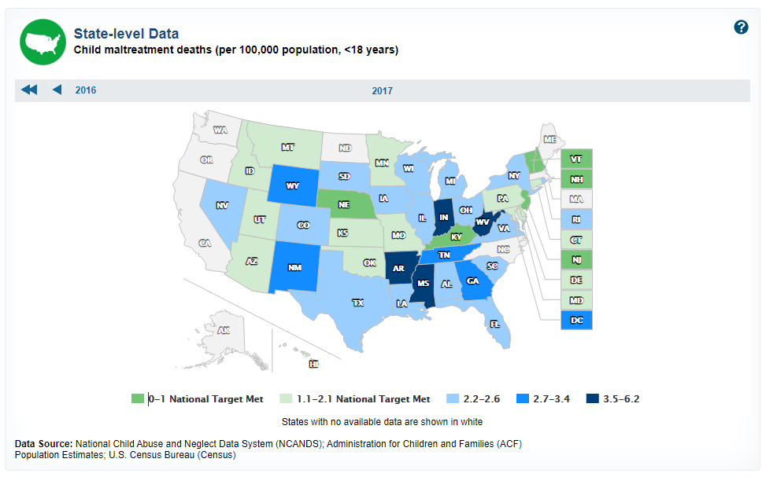

# Child maltreatment

Injury or death of population less than age 18 due to maltreatment per 100,000 population

## Justice & Safety

### Goal: Protection for the vulnerable

Texas protects the vulnerable from traumatic experiences

### Type: Secondary indicator

Updated: yes

Data Release Date: 

Comparisons: States

----

Date: 2017

Latest Value: 2.5 

State Rank: 39

Peer Rank: 

----

Previous Date: 2016

Previous Value: 3.0

Previous State Rank: 43

Previous Peer Rank: 

----
Metric Trend: up

Target: 

Baseline: 

Target Value: 

Previous Trend: 

### Value

| Year        |  Value      | Rank        | Previous Year | Previous Value | Previous Rank | Trend | 
| ----------- | ----------- | ----------- | ----------- | ----------- | ----------- | -----------|
|    2017     | 2.5         |  39         |    2016     |    3.0      | 43         |   up       | 

### Data

### Source

[CDC](https://www.healthypeople.gov/2020/data/map/4775?year=2017)

### Notes

### Indicator Page

N/A

### DataLab Page

N/A
