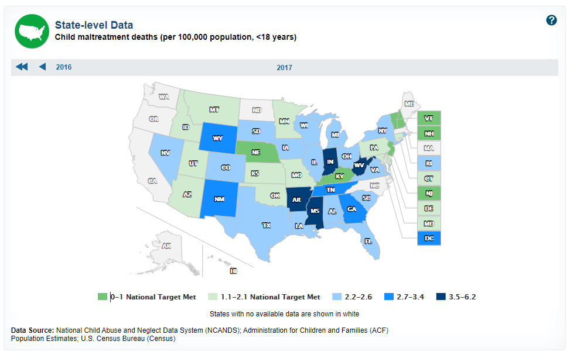

# Injury or death of population less than age 18 due to maltreatment per 100,000 population

## Health

### Primary Indicator

### Goal

Population health

Texans live long, healthy, and productive lives

### Value

| Year        |  Value      | Rank        | Previous Year | Previous Value | Previous Rank | Trend | 
| ----------- | ----------- | ----------- | ----------- | ----------- | ----------- | -----------|
|    2017     | 2.5         |  39         |    2016     |    3.0      | 43         |   up       | 

### Data

### Source

[CDC](https://www.healthypeople.gov/2020/data/map/4775?year=2017)

### Notes

### Indicator Page

N/A

### DataLab Page

N/A