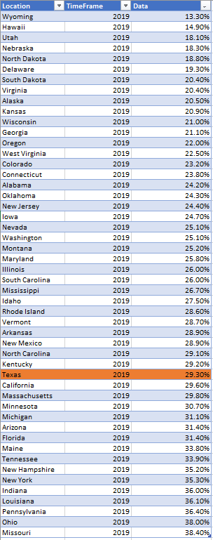
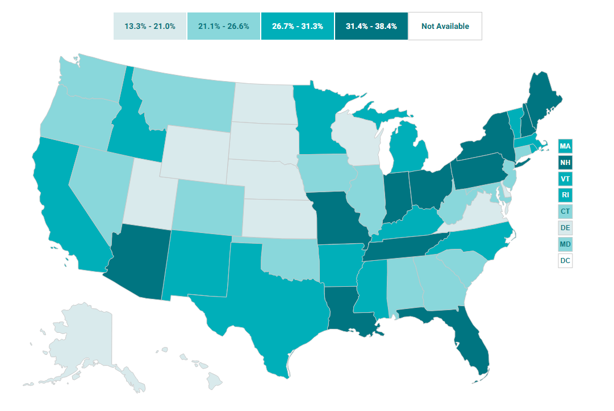

# State budget impact

Medicaid expenditures as percent of state budget

## Health Outcomes

### Goal: Value-driven system

Texas has a high-value health care system that optimizes cost and delivers results

### Type: Secondary indicator

Updated: yes

Data Release Date: 

Comparisons: States

----

Date: 2019

Latest Value: 0.293

State Rank: 35

Peer Rank: 7

----

Previous Date:  2018

Previous Value: 0.294

Previous State Rank:   7

Previous Peer Rank: 6

----
Metric Trend: down

Target: 

Baseline: 

Target Value: 

Previous Trend: 

<!--### Value

|Year         |  Value      | Rank        | Previous Year| Previous Value | Previous Rank  | Trend| 
| ----------- | ----------- | ----------- | ----------- | ----------- | ----------- | -----------|
|    2019    |    29.3%      |     35      |     2018    |    29.4%      |    34      |   flat      |

-->
### Data

### Source

[Shadac](http://statehealthcompare.shadac.org/map/103/medicaid-expenses-as-a-percent-of-state-budgets#a/27/140)

### Notes

### Indicator Page

N/A

### DataLab Page

[DataLab Link](https://datalab.texas2036.org/rfrnamd/u-s-budget-expenditure-by-states?accesskey=wpraajc)
