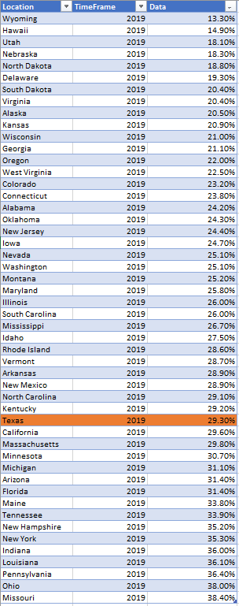
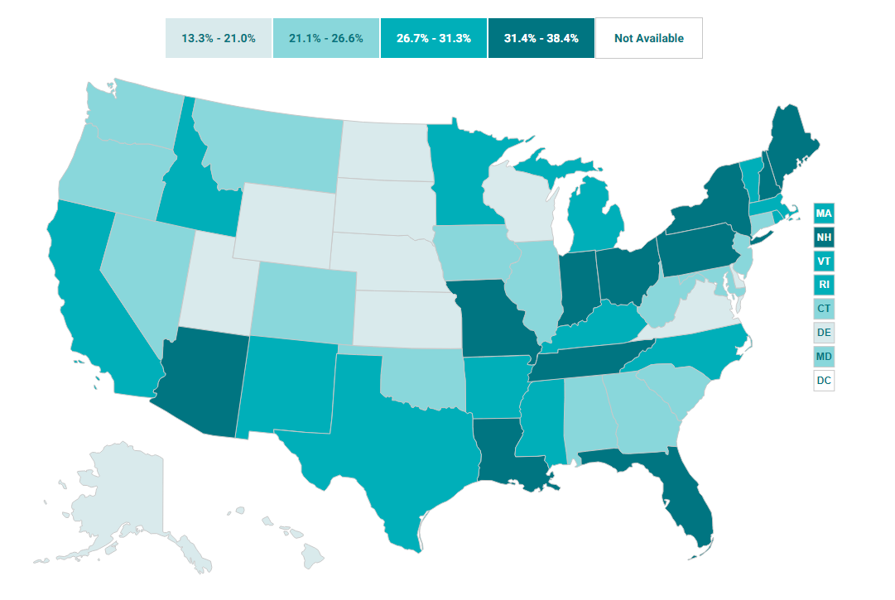

# Medicaid expenditures as percent of state budget

## Health

### Primary Indicator

### **Goal**

Postsecondary

Texas students earn a postsecondary credential to access the jobs of today and tomorrow

Comparisons: States

### Value

|Year         |  Value      | Rank        | Previous Year| Previous Value | Previous Rank  | Trend| 
| ----------- | ----------- | ----------- | ----------- | ----------- | ----------- | -----------|
|    2019    |    29.3%      |     35      |     2018    |    29.4%      |    34      |   flat      |

### Data

### Source

[Shadac](http://statehealthcompare.shadac.org/map/103/medicaid-expenses-as-a-percent-of-state-budgets#a/27/140)

### Notes

### Indicator Page

N/A

### DataLab Page

[DataLab Link](https://datalab.texas2036.org/rfrnamd/u-s-budget-expenditure-by-states?accesskey=wpraajc)