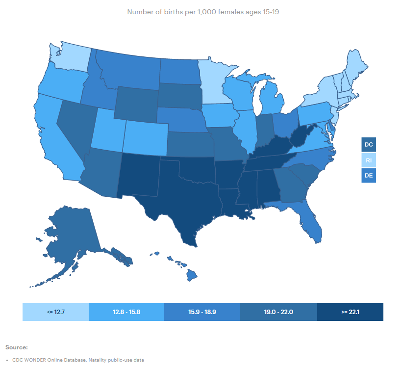
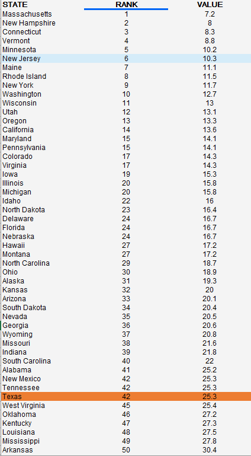

# Teen births

Number of births per 1,000 females ages 15-19

## Health Outcomes

### Goal: Public health

Texans and their communities are empowered to adopt healthy lifestyles

### Type: Secondary indicator

Updated: yes

Data Release Date: 

Comparisons: States

----

Date: 2020

Latest Value: 25.3 

State Rank: 42

Peer Rank: 

----

Previous Date: 2019

Previous Value: 27.6

Previous State Rank: 44

Previous Peer Rank: 

----
Metric Trend: up

Target: 

Baseline: 

Target Value: 

Previous Trend: 

### Value

| Year      |  Value      | Rank        | Previous Year | Previous Value | Previous Rank | Trend | 
| ----------- | ----------- | ----------- | ----------- | ----------- | ----------- | -----------|
|   2020       | 25.3       |  42         |      2019   |   27.6      |      44    |    up       | 

### Data

### Source

[AmericasHealthRankings](https://www.americashealthrankings.org/explore/annual/measure/birthweight/state/ALL)

### Notes

### Indicator Page

N/A

### DataLab Page

[DataLab Link](https://datalab.texas2036.org/uxoopxe/health-of-women-and-children-report-for-u-s?accesskey=kzuqchb)

