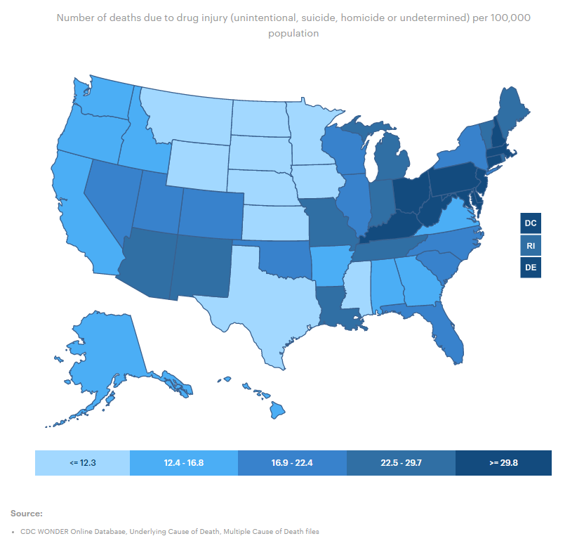
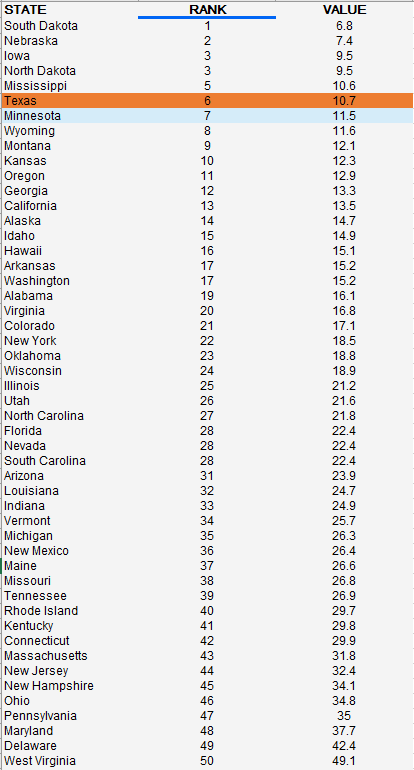

# Drug deaths

Number of deaths due to drug injury per 100,000 population

## Health Outcomes

### Goal: Public health

Texans and their communities are empowered to adopt healthy lifestyles

### Type: Secondary indicator

Updated: yes

Data Release Date: 

Comparisons: States

----

Date: 2020

Latest Value: 10.7

State Rank: 5

Peer Rank: 1

----

Previous Date:  2019

Previous Value: 10.6

Previous State Rank:   1

Previous Peer Rank: 1

----
Metric Trend: flat

Target: 

Baseline: 

Target Value: 

Previous Trend: 

<!--### Value

| Year      |  Value      | Rank        | Previous Year | Previous Value | Previous Rank | Trend | 
| ----------- | ----------- | ----------- | ----------- | ----------- | ----------- | -----------|
|   2020     | 10.7        |  6        |      2019    |   10.3    | 4       |    down       | 

-->
### Data

### Source

[AmericasHealthRankings](https://www.americashealthrankings.org/explore/annual/measure/colorectal_cancer_screening/state/ALL)

### Notes

### Indicator Page

[Indicator Link](https://indicators.texas2036.org/indicator/57)

### DataLab Page

[DataLab Link](https://datalab.texas2036.org/vsmoehc/drug-overdose-deaths-in-the-united-states-1999-2015?accesskey=rvlnetf)
