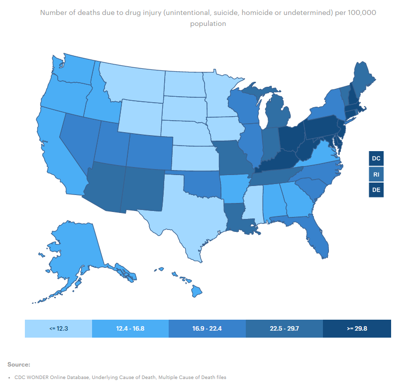
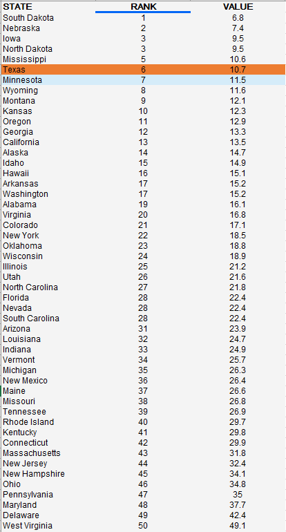

# Drug deaths
Number of deaths due to drug injury per 100,000 population
## Health Outcomes
### Goal: Public health
Texans and their communities are empowered to adopt healthy lifestyles
### Type: Secondary indicator
Updated: yes
Data Release Date: 

Comparisons: States

### Value

| Year      |  Value      | Rank        | Previous Year | Previous Value | Previous Rank | Trend | 
| ----------- | ----------- | ----------- | ----------- | ----------- | ----------- | -----------|
|   2020     | 10.7        |  6        |      2019    |   10.3    | 4       |    down       | 

### Data

### Source

[AmericasHealthRankings](https://www.americashealthrankings.org/explore/annual/measure/colorectal_cancer_screening/state/ALL)

### Notes

### Indicator Page

[Indicator Link](https://indicators.texas2036.org/indicator/57)

### DataLab Page

[DataLab Link](https://datalab.texas2036.org/vsmoehc/drug-overdose-deaths-in-the-united-states-1999-2015?accesskey=rvlnetf)