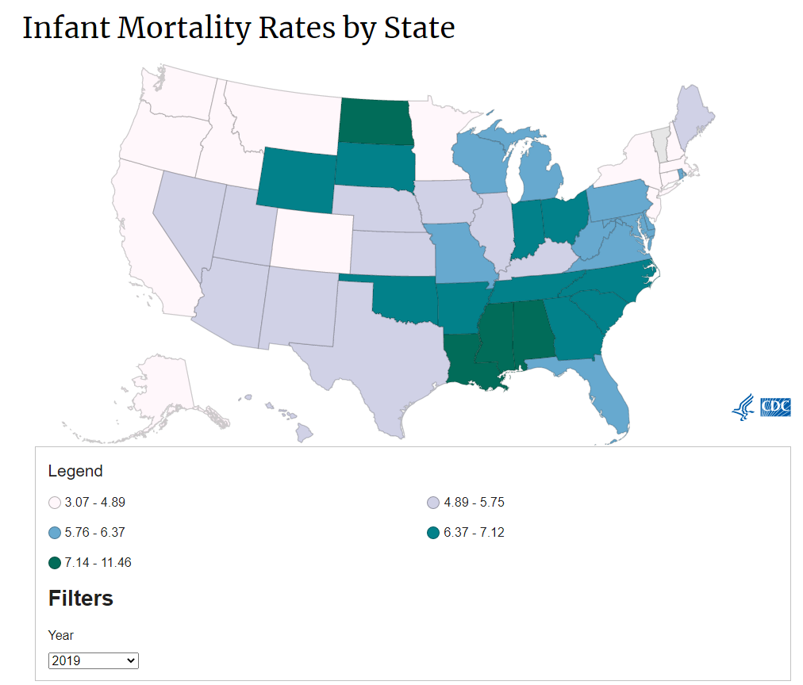

# Infant mortality

Number of infant deaths before age 1 per 1,000 live births

## Health Outcomes

### Goal: Public health

Texans live long, healthy, and productive lives

### Type: Secondary indicator

Updated: yes

Data Release Date: 

Comparisons: States

----

Date: 2019

Latest Value: 5.49

State Rank: 43

Peer Rank: 10

----

Previous Date:  2018

Previous Value: 5.48

Previous State Rank:   43

Previous Peer Rank: 10

----

Metric Trend: flat

Target: 

Baseline: 

Target Value: 

Previous Trend: 

<!--### Value

| Year        |  Value      | Rank        | Previous Year | Previous Value | Previous Rank | Trend | 
| ----------- | ----------- | ----------- | ----------- | ----------- | ----------- | -----------|
|    2019     |  5.49          |  21         |    2018     |   5.48      | 16       |  down       | 

-->
### Data

### Source

[CDC](https://www.cdc.gov/nchs/pressroom/sosmap/infant_mortality_rates/infant_mortality.htm)

### Notes

### Indicator Page

[Indicator Link](https://indicators.texas2036.org/indicator/53)

### DataLab Page

[DataLab Link](https://datalab.texas2036.org/licjbig/infant-mortality-by-cause-us-state-2003-2012-source-nvss?accesskey=erqxwie)
