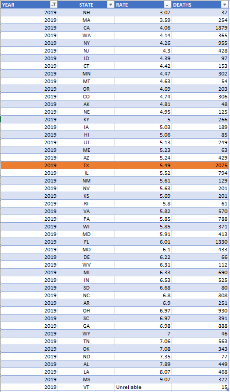
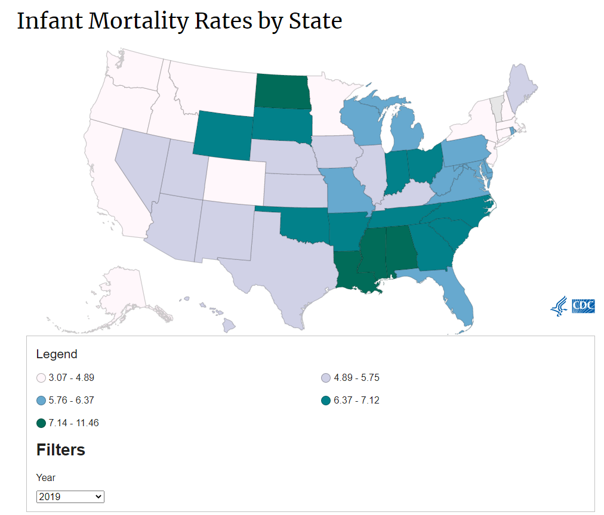

# Infant mortality

Number of infant deaths before age 1 per 1,000 live births
## Health Outcomes
### Goal: Population health
Texans live long, healthy, and productive lives
### Type: Secondary indicator
Updated: yes
Data Release Date: 

Comparisons: States

### Value

| Year        |  Value      | Rank        | Previous Year | Previous Value | Previous Rank | Trend | 
| ----------- | ----------- | ----------- | ----------- | ----------- | ----------- | -----------|
|    2019     |  5.49          |  21         |    2018     |   5.48      | 16       |  down       | 

### Data

### Source

[CDC](https://www.cdc.gov/nchs/pressroom/sosmap/infant_mortality_rates/infant_mortality.htm)

### Notes

### Indicator Page

[Indicator Link](https://indicators.texas2036.org/indicator/53)

### DataLab Page

[DataLab Link](https://datalab.texas2036.org/licjbig/infant-mortality-by-cause-us-state-2003-2012-source-nvss?accesskey=erqxwie)
