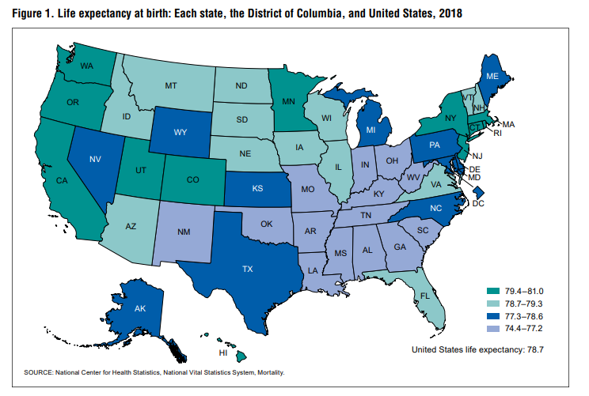
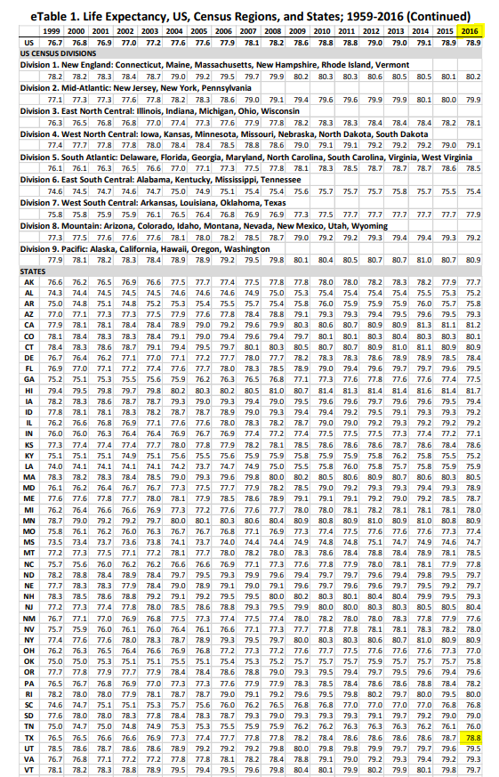

# Life expectancy

Number of years from birth a person is expected to live

## Health Outcomes

### Goal: Public health

Texans live long, healthy, and productive lives

### Type: Primary indicator

Updated: yes

Data Release Date: 

Comparisons: States

----

Date: 2018

Latest Value: 79.1

State Rank: 25

Peer Rank: 8

----

Previous Date:  2016

Previous Value: 78.8

Previous State Rank: 30

Previous Peer Rank: 8

----
Metric Trend: flat

Target: Top 3

Baseline: 79.1 (2016-2018)

Target Value: 80.5

Previous Trend: Flat

<!--### Value

|Year         |  Value      | Rank        | Previous Year| Previous Value | Previous Rank  | Trend| 
| ----------- | ----------- | ----------- | ----------- | ----------- | ----------- | -----------|
|    2020     |   79.2      |     25      |    2010     |     78.4    |     30      |     up     |

-->
### Data

### Source

[County Health Rankings - 2021 Report](https://www.countyhealthrankings.org/sites/default/files/media/document/CHR2021_TX.pdf)

[Previous Years - Journal of the American Medical Association](https://cdn.jamanetwork.com/ama/content_public/journal/jama/938283/jsc190006supp1_prod.pdf?Expires=2147483647&Signature=Jf3AfNo~8yhdMy2mBSCzAe5qqt8tpe0tfMxhf~jAuJpM5fKlieW3BNnQp-GHMpA8aRPAttLr38l5FShvdvjj5MAC42GtZUGTpH9wSE372PRvL7UXecBPEh21owmfe3GkFCBblkFaYYRSghRlMdll-96UUKW3PuELFfecxTidHOuOiLhta2ns3hiQfD5oFqPy6a6gF00Wk61qCzsP0E3JsDEQ1m5bdi6GpiBL5uaRJm892dq-OpqRMnr9exwHysnUxujENdtrkN4PkOghnwWjBhKmgRrT3dd-W-MQFryjXx-uMbRlje8WsSMS~SDJY8Dp-gqDFbIDCZM6uICDcabuFg__&Key-Pair-Id=APKAIE5G5CRDK6RD3PGA)

<!-- https://cdn.jamanetwork.com/ama/content_public/journal/jama/938283/jsc190006supp1_prod.pdf?Expires=2147483647&Signature=Jf3AfNo~8yhdMy2mBSCzAe5qqt8tpe0tfMxhf~jAuJpM5fKlieW3BNnQp-GHMpA8aRPAttLr38l5FShvdvjj5MAC42GtZUGTpH9wSE372PRvL7UXecBPEh21owmfe3GkFCBblkFaYYRSghRlMdll-96UUKW3PuELFfecxTidHOuOiLhta2ns3hiQfD5oFqPy6a6gF00Wk61qCzsP0E3JsDEQ1m5bdi6GpiBL5uaRJm892dq-OpqRMnr9exwHysnUxujENdtrkN4PkOghnwWjBhKmgRrT3dd-W-MQFryjXx-uMbRlje8WsSMS~SDJY8Dp-gqDFbIDCZM6uICDcabuFg__&Key-Pair-Id=APKAIE5G5CRDK6RD3PGA -->

<!-- [U.S. State Life Tables, 2018](https://www.cdc.gov/nchs/data/nvsr/nvsr70/nvsr70-1-508.pdf)

https://www.cdc.gov/nchs/pressroom/sosmap/life_expectancy/life_expectancy.htm

by state, 1979-2016
https://cdn.jamanetwork.com/ama/content_public/journal/jama/938283/jsc190006supp1_prod.pdf?Expires=2147483647&Signature=Jf3AfNo~8yhdMy2mBSCzAe5qqt8tpe0tfMxhf~jAuJpM5fKlieW3BNnQp-GHMpA8aRPAttLr38l5FShvdvjj5MAC42GtZUGTpH9wSE372PRvL7UXecBPEh21owmfe3GkFCBblkFaYYRSghRlMdll-96UUKW3PuELFfecxTidHOuOiLhta2ns3hiQfD5oFqPy6a6gF00Wk61qCzsP0E3JsDEQ1m5bdi6GpiBL5uaRJm892dq-OpqRMnr9exwHysnUxujENdtrkN4PkOghnwWjBhKmgRrT3dd-W-MQFryjXx-uMbRlje8WsSMS~SDJY8Dp-gqDFbIDCZM6uICDcabuFg__&Key-Pair-Id=APKAIE5G5CRDK6RD3PGA -->

[Wikipedia](https://en.wikipedia.org/wiki/List_of_U.S._states_and_territories_by_life_expectancy)

### Notes

### Indicator Page

[Indicator Link](https://indicators.texas2036.org/indicator/52)

### DataLab Page

[DataLab Link](https://datalab.texas2036.org/USECVITN2017R/texas-2036?indicator=1000890&location=1001430&accesskey=nnbbtyd)

