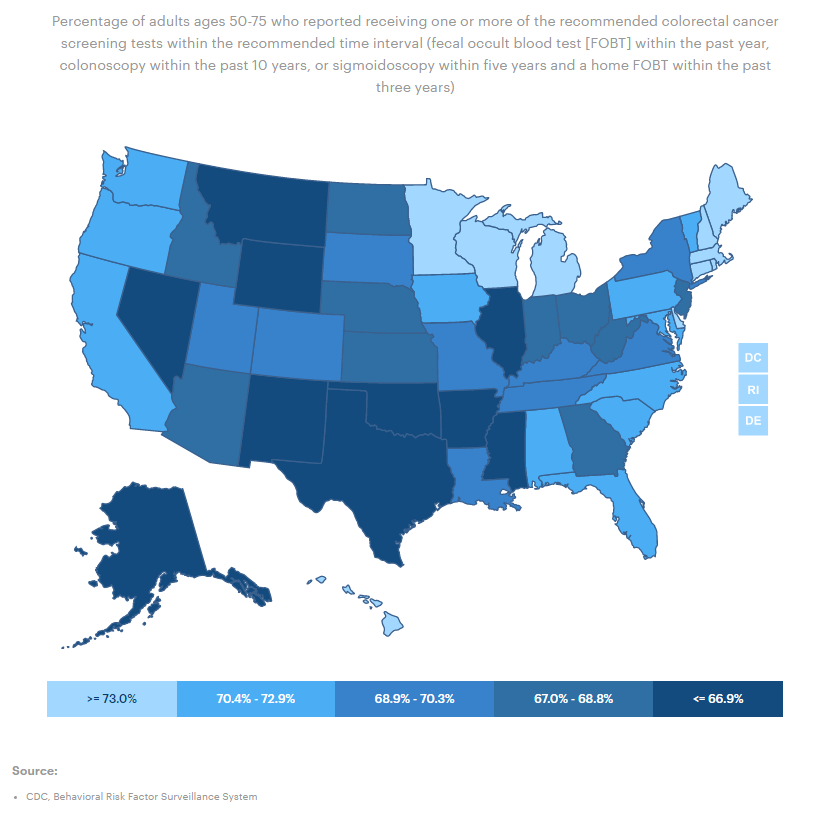
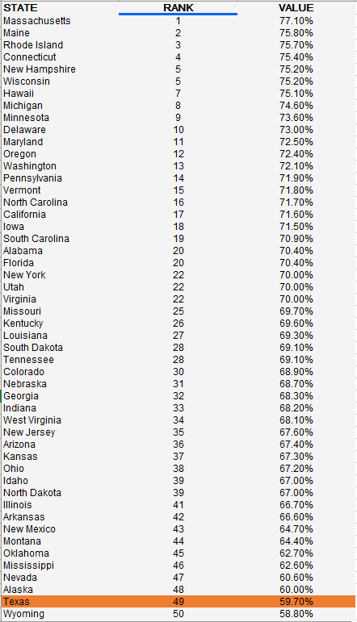

# Health screenings for seniors

Percent of adults ages 65 to 75 who reported receiving colorectal cancer screening within the recommended time period

## Health Outcomes

### Goal: Value-driven system

Texas has a high-value health care system that optimizes cost and delivers results

### Type: Secondary indicator

Updated: yes

Data Release Date: 

Comparisons: States

----

Date: 2018

Latest Value: 59.7%

State Rank: 49

Peer Rank: 12

----

Previous Date:  2016

Previous Value: 60.0%

Previous State Rank: 48

Previous Peer Rank: 12

----

Metric Trend: flat

Target: 

Baseline: 

Target Value: 

Previous Trend: 

### Value

| Year      |  Value      | Rank        | Previous Year | Previous Value | Previous Rank | Trend | 
| ----------- | ----------- | ----------- | ----------- | ----------- | ----------- | -----------|
|   2021     | 66.2%        |  47         |     2019   |   66.2%      | 47          |   flat     | 

### Data

### Source

[AmericasHealthRankings](https://www.americashealthrankings.org/explore/annual/measure/colorectal_cancer_screening/state/ALL)

### Notes

### Indicator Page

N/A

### DataLab Page

[DataLab Link](https://datalab.texas2036.org/bwhqgjc/behavioral-risk-factor-surveillance-system-brfss-prevalence-data?accesskey=cmiyhag)
