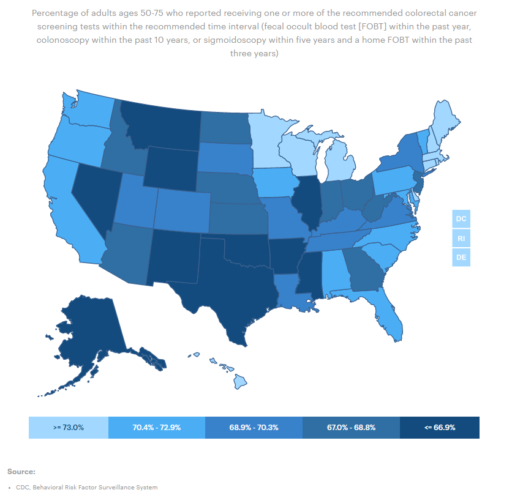
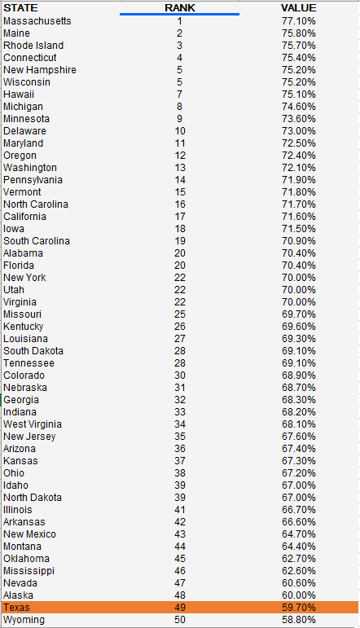

# Health screenings for seniors

Percent of adults ages 65 to 75 who reported receiving colorectal cancer screening within the recommended time period

## Health Outcomes

### Goal: Value-driven system

Texas has a high-value health care system that optimizes cost and delivers results

### Type: Secondary indicator

Updated: yes

Data Release Date: 

Comparisons: States

### Value

| Year      |  Value      | Rank        | Previous Year | Previous Value | Previous Rank | Trend | 
| ----------- | ----------- | ----------- | ----------- | ----------- | ----------- | -----------|
|   2020     | 59.7        |  49        |     N/A    |    N/A     | N/A         |           | 

### Data

### Source

[AmericasHealthRankings](https://www.americashealthrankings.org/explore/annual/measure/colorectal_cancer_screening/state/ALL)

### Notes

### Indicator Page

### DataLab Page

