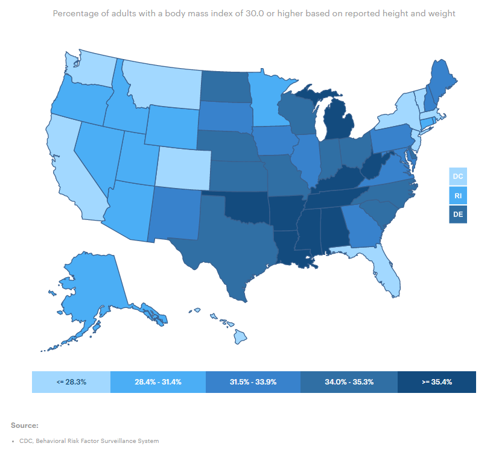
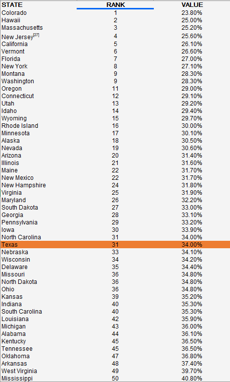

# Obesity

Percent of adults and children who are obese

## Health Outcomes

### Goal: Public health

Texans and their communities are empowered to adopt healthy lifestyles

### Type: Primary indicator

Updated: yes

Data Release Date: 

Comparisons: States

----

Date: 2019

Latest Value: 34.0%

State Rank: 31

Peer Rank: 11

----

Previous Date:  2018

Previous Value: 34.8%

Previous State Rank:  40

Previous Peer Rank: 12

----

Metric Trend: up

Target: Top 6

Baseline: 35% (adults); 32% (children)

Target Value: 31%

Previous Trend: Worsening (adults); Improving (children)

### Value

| Year      |  Value      | Rank        | Previous Year | Previous Value | Previous Rank | Trend | 
| ----------- | ----------- | ----------- | ----------- | ----------- | ----------- | -----------|
|   2020       | 17.2%       |  12         |      2019   |   16.5%      |     N/A     |    down       | 

### Data

### Source

[AmericasHealthRankings](https://www.americashealthrankings.org/explore/annual/measure/Obesity/state/ALL)

### Notes

### Indicator Page

N/A

### DataLab Page

N/A
