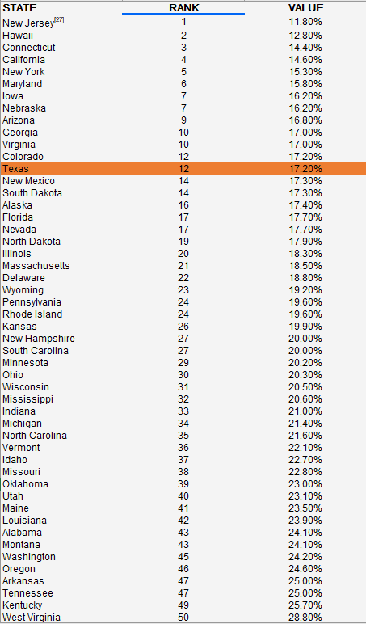
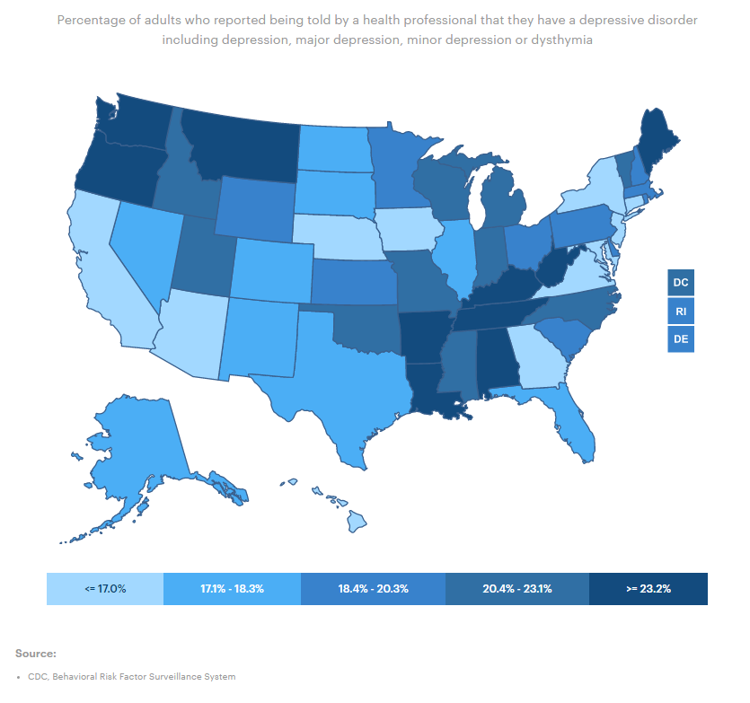

# Mental health

Percent of adults diagnosed with a depressive disorder including depression, major depression, dysthymia, or minor depression

## Health Outcomes

### Goal: Population health

Texans live long, healthy, and productive lives

### Type: Secondary indicator

Updated: yes

Data Release Date: 

### Value

| Year |  Value      | Rank        | Previous Year | Previous Value | Previous Rank | Trend | 
| ----------- | ----------- | ----------- | ----------- | ----------- | ----------- | -----------|
|     2020    | 17.20%       |    13      |     2019    |    16.5%    | 12         |  up       | 

### Data

### Source

[Americas Health Rankings](https://www.americashealthrankings.org/explore/annual)

### Notes

### Indicator Page

N/A

### DataLab Page

N/A