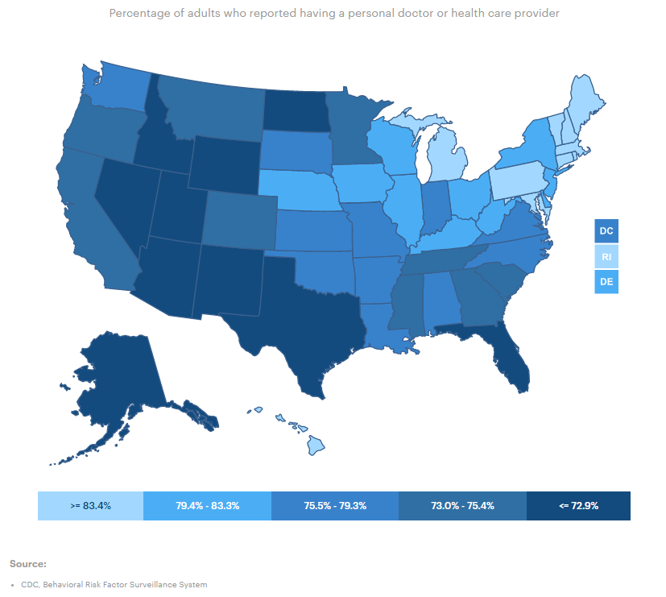
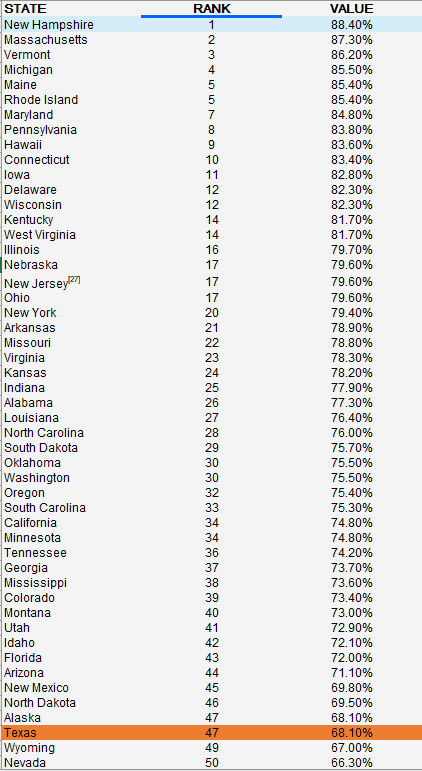

# Persons with usual primary care provider

Percent of adults who report having a "personal" health care provider

## Health Access

### Goal: Availability of health care

Texans have access to basic health care

### Type: Primary indicator

Updated: yes

Data Release Date: 

Comparisons: States

----

Date: 2020

Latest Value: 68.1% 

State Rank: 47

Peer Rank: 

----

Previous Date: 2018

Previous Value: 68.2%

Previous State Rank: 48

Previous Peer Rank: 12

----
Metric Trend: flat

Target: Top 3

Baseline: 68%

Target Value: 80%

Previous Trend: Flat

### Value

| Year        |  Value      | Rank        | Previous Year | Previous Value | Previous Rank | Trend | 
| ----------- | ----------- | ----------- | ----------- | ----------- | ----------- | -----------|
|   2020      | 68.1%       | 47           |    2018    |   68.2%    | 48         |   flat    | 

### Data

### Source

[Shadac](http://statehealthcompare.shadac.org/map/122/percent-of-adults-with-no-personal-doctor-by-total-2011-to-2019#a/27/159)

[AmericasHealthRankings](https://www.americashealthrankings.org/explore/annual/measure/dedicated_health_care_provider/state/ALL)

### Notes

### Indicator Page

[Indicator Link](https://indicators.texas2036.org/indicator/102)

### DataLab Page

[DataLab Link](https://datalab.texas2036.org/bwhqgjc/behavioral-risk-factor-surveillance-system-brfss-prevalence-data?accesskey=huldrhb)

