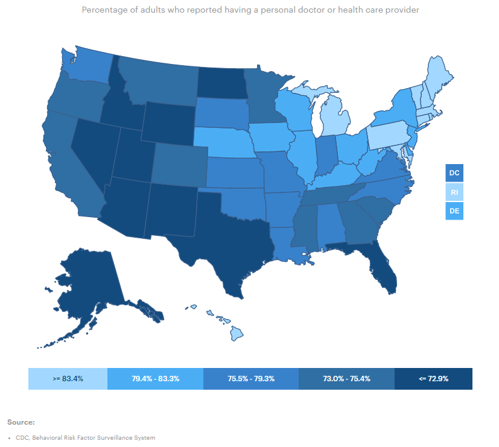
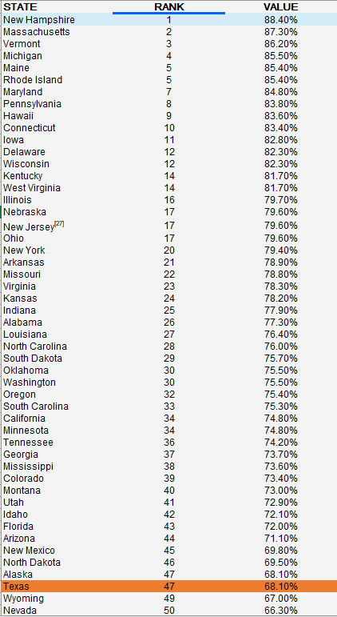

# Percent of adults who report having a personal health care provider

# Health

### Primary Indicator

### Goal

Population health

Texans live long, healthy, and productive lives

### Value

| Year        |  Value      | Rank        | Previous Year | Previous Value | Previous Rank | Trend | 
| ----------- | ----------- | ----------- | ----------- | ----------- | ----------- | -----------|
|   2020      | 68.1%       | 47           |    N/A    |    N/A    | N/A         |           | 

### Data

### Source

[AmericasHealthRankings](https://www.americashealthrankings.org/explore/annual/measure/dedicated_health_care_provider/state/ALL)

### Notes

### Indicator Page

[Indicator Link](https://indicators.texas2036.org/indicator/102)

### DataLab Page

[DataLab Link](https://datalab.texas2036.org/bwhqgjc/behavioral-risk-factor-surveillance-system-brfss-prevalence-data?accesskey=huldrhb)

