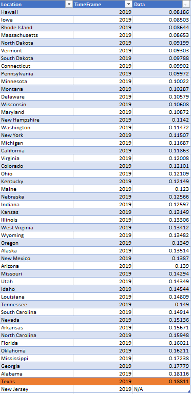
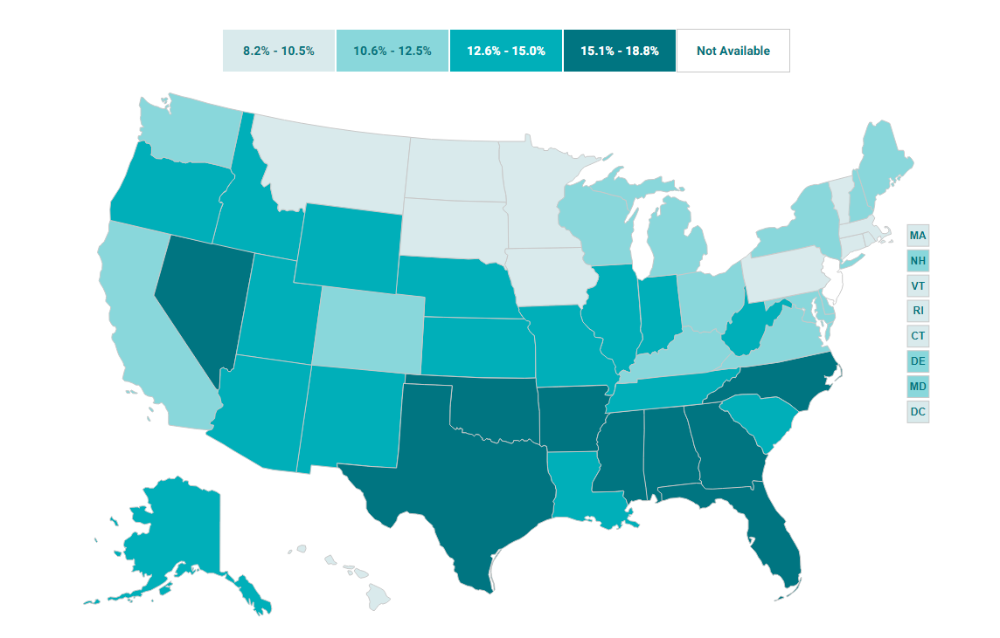

# Texans unable to get care due to medical cost

Percent of adults who report needing to see a doctor in past year but could not due to cost

## Health Affordability

### Goal: Affordability of health care

Texans are able to afford the basic health care they need

### Type: Primary indicator

Updated: yes

Data Release Date: 

Comparisons: States

----

Date: 2020

Latest Value: 18.8

State Rank: 51

Peer Rank: 12

----

Previous Date:  2019

Previous Value: 16.8

Previous State Rank:   12

Previous Peer Rank: 11

----
Metric Trend: down

Target: Top 3

Baseline: 17%

Target Value: 11%

Previous Trend: Improving

### Value

| Year |  Value      | Rank        | Previous Year | Previous Value | Previous Rank | Trend | 
| ----------- | ----------- | ----------- | ----------- | ----------- | ----------- | -----------|
|    2019     | 18.8%       |  50        |       2018   |    16.8%     | 48         |   down       | 

### Data

### Source

[Shadac - State Health Compare](http://statehealthcompare.shadac.org/map/178/percent-of-adults-who-could-not-get-medical-care-when-needed-due-to-cost-by-total-2011-to-2019#a/27/211)

### Notes

### Indicator Page

[Indicator Link](https://indicators.texas2036.org/indicator/137)

### DataLab Page

[DataLab Link](https://datalab.texas2036.org/bwhqgjc/behavioral-risk-factor-surveillance-system-brfss-prevalence-data?accesskey=aoasocg)
